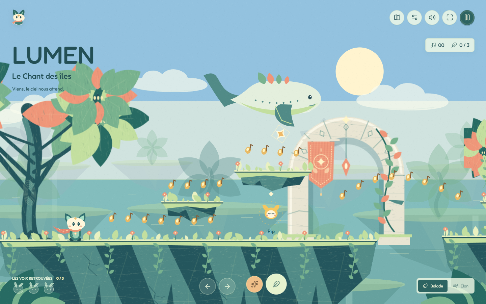
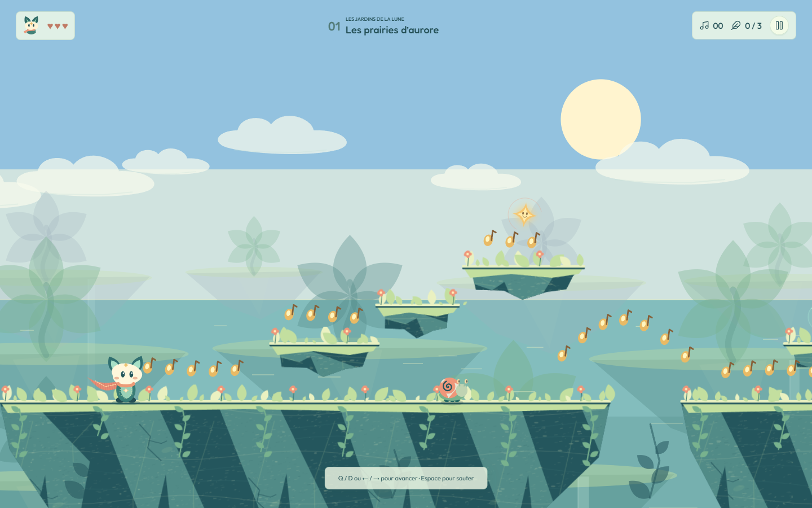

# LUMEN



**Lumen est le petit renard à l'écharpe. LUMEN est son aventure.**

L'île des petits matins est le premier écran : une île vivante, déjà jouable.
Le titre et l'invitation s'effacent au premier déplacement. Aucun menu à
traverser, aucun compte, aucune connexion requise.

Ouvrir [index.html](index.html), ou [LUMEN.html](LUMEN.html) pour l'édition
autonome. Les deux fonctionnent en `file://`, sans serveur ni construction
préalable. Sur téléphone, les mêmes fichiers peuvent être servis par un
hébergement statique. Aucune application native n'est publiée en boutique.

## Une Entrée, Plusieurs Destinations

**Un seul atlas des lumières rassemble tout le voyage.** Trois constellations
relient les trois îles aux stages de campagne. Chaque île est une étape de
repos, sans créature hostile : île 1 → acte I → île 2 → acte II → île 3 →
acte III → finale. L'observatoire et les Rêves nomades restent hors du chemin
obligatoire. La quête de la coupole reste nécessaire pour entrer dans les Rêves.

La carte s'ouvre uniquement sur demande, depuis le jeu, la pause ou une fin
de lieu. Elle suspend une île ou un chapitre et permet de le reprendre.
Choisir une lumière montre son nom, ses records et, si elle dort encore,
la condition qui l'ouvre. Les fragments et les détours restent facultatifs.
Les succès ajoutent de petites lumières ; une partie moins réussie ne les
retire jamais. Les passages secrets sont désormais mémorisés par stage.

Sur téléphone, on change explicitement de constellation avec les boutons
d'acte. Au clavier ou à la manette, les directions parcourent les lieux et
les actions ; Entrée/A choisit, Échap/B revient. Un lieu verrouillé reste
consultable. Les îles déjà terminées et les chapitres historiquement ouverts
restent accessibles lors de cette nouvelle organisation.

Chaque lancement revient à l'île 1, même pour un profil avancé. Les îles
déverrouillées, souvenirs et records restent dans l'atlas. La position au
milieu d'une île n'est pas sauvegardée. Ajouter `?classic` à l'adresse garde
l'entrée directe de développement dans la campagne.

### Le Chant Des Îles

Lumen retrouve les neuf voix d'Auralis. Chaque île contient trois échos et
trois souvenirs facultatifs. L'appel de Résonance retrouve les échos ; les
trois voix réunies ouvrent le passage. Les compagnons suivent ensuite Lumen,
enrichissent la musique et font refleurir le paysage.

| Île | Décision propre au lieu |
| --- | --- |
| L'île des petits matins | Découvrir le vol, les notes et le premier appel. |
| Les récifs du ciel | Inverser par l'appel un courant latéral pour traverser ou revenir vers une corniche. |
| Le grand chœur | Poursuivre Nève ou couper son trajet entre deux corniches avant de l'appeler. |

Une note prise en vol rend le second saut disponible. À dix notes enchaînées,
Lumen gagne un peu de vitesse. Relâcher le saut replie les ailes et permet de
sortir d'un courant. Les îles n'ont pas été allongées : 73, 82 et 90 notes,
aux longueurs d'origine.

**Balade** revient au dernier sol stable après une chute et laisse quatre
secondes entre deux notes. **Élan** revient à la dernière lanterne, ramène
l'intervalle à 2,5 secondes et conserve un chrono personnel. Aucun des deux
ne retire un écho retrouvé. Changer de rythme recommence l'île après
confirmation ; leurs records sont séparés.

### Les Jardins Et Les Rêves

La campagne conserve ses onze chapitres, secrets, lanternes, médailles et
contre-la-montre. Le même Lumen porte les quatre pouvoirs temporaires :
`bloom`, `breeze`, `comet`, `echo`. Halos, expiration, glissade, ruée, dégâts
et défaite ont un dessin commun. Le vol plané reste propre au Chant.

À l'observatoire, les trois carillons rendent son souffle à la coupole.
Cette quête ouvre les Rêves nomades, même lorsqu'on passe par un menu.
Vesper et Ombeline conservent leurs dialogues. Une expédition comprend cinq
salles, des choix de routes, un refuge enregistré et un gardien. Sa graine
permet de rejouer la même nuit. Les améliorations des souvenirs restent
reportées, comme indiqué dans le [backlog](BACKLOG.md).



## Commandes Et Réglages

| Action | Clavier | Tactile | Manette en jeu |
| --- | --- | --- | --- |
| Avancer | Flèches, Q/D ou A/D | Flèches | Stick ou croix |
| Sauter | Espace, Z, W ou haut | Plume | A ou B |
| Second saut / vol du Chant | Appuyer à nouveau / maintenir | Même bouton de saut | Même bouton de saut |
| Résonance / pouvoir | X ou J | Étincelles | X |
| Courir | Maj | Maintenir une direction | Gâchette ou épaule droite |
| Glisser dans les jardins | Bas en courant | Bas | Bas |
| Pause | Échap ou P | Pause | Start |
| Recommencer / son | R / M | Menus | Menus non intégralement validés |

Notes et souvenirs forment les deux compteurs ; les cœurs restent visibles.
Les souffles restants de la campagne se consultent en pause. Les anciens
champs de score et de vies restent internes pour la compatibilité des profils.

Les réglages proposent **Système**, **Clair** et **Sombre**, changement
immédiat et préférence mémorisée. Les huit thèmes de campagne et les trois
îles ont de vraies palettes jour/nuit, sans filtre global. Ciel en bandes,
mer, facettes, feuillages et notes viennent du même module. Fredoka et Outfit
sont locales ; les polices arabes et chinoises de l'appareil prennent le relais.

Le français, l'anglais, l'espagnol, l'arabe et le chinois simplifié couvrent
menus, niveaux, dialogues et noms accessibles. **Lumen** reste identique
dans les cinq langues. La première langue compatible du navigateur est
choisie, avec repli anglais. Un choix manuel est conservé. Le RTL n'inverse
ni le monde, ni les directions, ni les graines.

Trois partitions originales sont synthétisées par Web Audio. Le mixage
sépare musique, effets et ambiance. **Écouter LUMEN** fonctionne aussi en
pause. L'audio commence après interaction et respecte le mode silencieux.
La nuit change l'orchestration. Aucune ressource n'est téléchargée en jeu.
Main dominante, taille des commandes et mouvements réduits sont mémorisés.

## Sauvegardes

Les clés `lumen.gardens.v1`, `lumen.gardens.v2`, `lumen.gardens.v3`, les clés
de chapitres et de transformations restent inchangées. La migration conserve
la source historique et les copies défensives protègent les profils valides.
Les sessions `song`, `campaign`, `hub` et `expedition` restent distinctes.

Le stockage dépend du navigateur, de l'origine ou du chemin local. Déplacer
le fichier ou changer de navigateur ne transfère pas automatiquement la
progression. Un stockage refusé n'empêche pas de jouer, mais interdit sa
conservation. Le joueur ou le système peut effacer les données du navigateur.
Il n'existe ni compte, ni serveur, ni synchronisation entre appareils.

## Vérifier

Node 18 ou plus suffit aux suites Node et au build. Les dépendances de
développement ne sont nécessaires que pour les tests Playwright.

```sh
npm install
npm run verify
```

`verify` reconstruit le portable, lance huit suites Node et tous les
contrôles navigateur. [tools/browser.cjs](tools/browser.cjs) utilise Chromium
ou un Chrome/Edge installé. Ne pas désactiver TLS si son téléchargement est
refusé par un environnement d'entreprise.

```sh
node tools/build.cjs
node tests/test-renderer.cjs
node tests/test-i18n.cjs
npm run test:browser -- "huit plateformes|Le parcours"
node tests/identity-captures.cjs after
```

Un test reconstruit le portable sans `node_modules` et le compare octet pour
octet. Le test de nom inspecte sources, catalogues, tests et portable ; les
historiques de `docs/` sont explicitement exclus.

Consulter le [rapport intégral](docs/iteration-05/verify-final.txt), la
[note d'itération](docs/iteration-05/README.md), les
[captures avant/après](docs/iteration-05/captures/README.md) et les
[mesures des plateformes](docs/iteration-05/platforms/measurements.json).
Le parcours navigateur joue un chapitre après passage par l'atlas et revient
à l'île, sans téléportation, invulnérabilité injectée ni `complete()` manuel.

**Aucun playtest humain n'a eu lieu.** Contrastes, captures et parcours
automatiques ne prouvent ni le plaisir, ni la compréhension sans texte,
ni la lisibilité perçue : ces qualités restent des hypothèses. Aucun FPS
de Chromium logiciel n'est présenté comme un résultat de performance.

## Organisation Et Licences

| Fichier | Responsabilité |
| --- | --- |
| [js/song.js](js/song.js) | Îles, échos, enchaînements et leurs deux décisions nouvelles. |
| [js/engine.js](js/engine.js) | Simulation, collisions et sessions existantes. |
| [js/world-art.js](js/world-art.js) | Palettes, facettes, terrains, feuillages, nuages, mer et notes partagés. |
| [js/song-art.js](js/song-art.js) | Dessin unique de Lumen et composition du Chant. |
| [js/renderer.js](js/renderer.js) | Jardins, coupole, créatures et Rêves. |
| [js/song-ui.js](js/song-ui.js), [js/ui.js](js/ui.js) | Atlas, HUD et navigation. |
| [js/save.js](js/save.js) | Contrat historique de stockage et migration défensive. |
| [song.css](song.css), [style.css](style.css) | Interface commune et mises en page. |
| [tools/build.cjs](tools/build.cjs) | Génération du portable, jamais édité à la main. |

Ressources embarquées : [Fredoka](assets/LICENSE-fredoka.txt) et
[Outfit](assets/LICENSE-outfit.txt), SIL Open Font License 1.1 ;
[Lucide](assets/LICENSE-lucide.txt), ISC. Dessins et partitions sont locaux.
Cette itération n'ajoute aucune ressource externe, aucun backend, Angular,
3D ou multijoueur.
