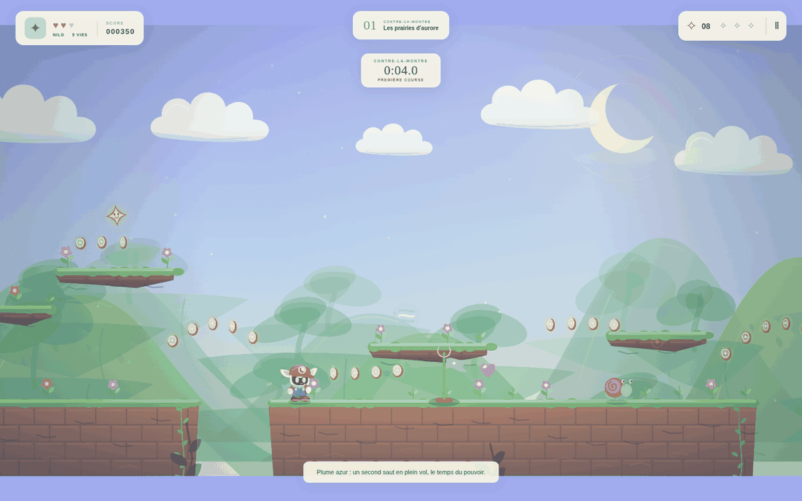
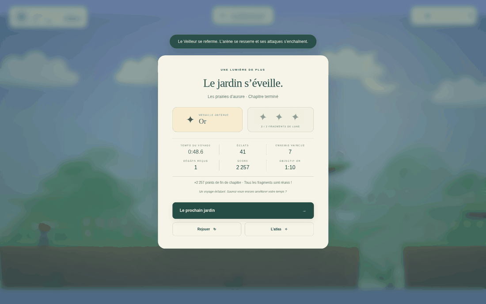

# LUMEN — Les jardins de la lune

Bienvenue.



Un jeu de plateforme original en dix étapes. Nilo, un petit gardien ailé,
traverse les prairies, les racines, un lagon, les archipels du ciel, la forge,
le palais de givre, un jardin oublié, les vergers du vent et la galerie des
échos avant d’affronter le Veilleur de l’éclipse. Chaque niveau propose un
parcours principal et trois éclats de lune à chercher sur des chemins
facultatifs. Les pouvoirs facilitent l’exploration ; ils ne sont jamais
nécessaires pour rejoindre une sortie.

## Jouer

Ouvrir **index.html** dans un navigateur récent. Aucun téléchargement d’asset,
serveur, compte ni compilation n’est nécessaire. Le son démarre après la
première interaction, conformément au fonctionnement des navigateurs.

**LUMEN.html** est l’édition portable : le jeu entier tient dans ce seul fichier,
que l’on peut déplacer ou transmettre indépendamment du dossier `js`.
Les deux éditions possèdent le même contenu. L’affichage tactile s’adapte
au portrait ; le paysage offre davantage de visibilité devant le personnage.

La progression est enregistrée localement lorsque le navigateur autorise
`localStorage`. Le jeu reste jouable si ce stockage est indisponible.

| Action | Clavier |
| --- | --- |
| Se déplacer | Flèches gauche/droite, Q/D ou A/D |
| Sauter / nager | Espace, ↑, Z ou W |
| Courir | Maj |
| Glisser | ↓ ou S |
| Utiliser le pouvoir | X ou J |
| Pause / reprendre | Échap ou P |
| Recommencer le chapitre | R |
| Activer / couper le son | M |

Un appui court produit un saut court. Un appui prolongé donne de la hauteur.
La plume azur permet un deuxième saut ; la fleur solaire lance une étincelle ;
la comète donne une impulsion rapide ; le grelot d’écho révèle des plateformes
invisibles. Les commandes tactiles sont proposées sur les appareils
compatibles. Les lanternes marquent les checkpoints.

## Deux façons de parcourir un jardin

Dans l’atlas, chaque chapitre se lance en **Exploration** ou en
**Contre-la-montre**. Les deux modes contiennent exactement le même niveau :
le contre-la-montre ajoute seulement un chronomètre à l’écran et enregistre un
meilleur temps personnel par chapitre. Aucun compte à rebours, aucune pénalité
et aucun contenu réservé : prendre son temps reste une façon complète de jouer.

Les **médailles** se gagnent dans les deux modes et récompensent la maîtrise
plutôt que la seule vitesse :

| Médaille | Condition |
| --- | --- |
| Or | 3 fragments · 1 dégât au maximum · sous le temps d’or |
| Argent | 2 fragments · 3 dégâts au maximum · sous le temps d’argent |
| Bronze | Terminer le chapitre |

Les objectifs de temps (`medalTargets`) sont volontairement larges : une course
directe traverse le premier chapitre en une dizaine de secondes, pour un
objectif d’or à 1:10. La véritable exigence de l’or est donc de réunir les trois
fragments — qui se trouvent tous sur des détours — en ne se faisant toucher
qu’une fois. La course pure se joue sur le meilleur temps personnel, pas sur la
médaille. Une course plus faible ne retire jamais une médaille déjà obtenue.

L’écran de fin de chapitre récapitule le temps, les éclats, les ennemis vaincus,
les dégâts subis, le score et la médaille, et signale un nouveau record.



## Architecture

Les scripts sont des fichiers JavaScript classiques, chargés dans l’ordre par
`index.html`. Cette organisation conserve l’ouverture directe via `file://`.
Les graphismes et l’audio sont générés dans le navigateur, sans ressources tierces.

- `js/engine.js` : boucle de simulation, entrées, déplacements, collisions,
  ennemis, pouvoirs, médailles, progression et combat final.
- `js/renderer.js` : décors en parallaxe, dessin des personnages et du monde,
  animation, lumière et effets visuels.
- `js/levels.js` : définitions des dix niveaux et factory de copie indépendante.
- `js/audio.js` : musique et bruitages synthétisés avec Web Audio.
- `js/ui.js` : menus, carte, HUD, contrôles et états de fin de partie.
- `style.css` : présentation et adaptation de l’interface aux écrans.

## Sensations et retours

Le personnage possède trois impulsions courtes — atterrissage, saut, départ en
course — appliquées autour de ses pieds par `landTimer`, `jumpTimer` et
`runStartTimer`. Elles déforment le dessin sans jamais modifier la boîte de
collision : la lisibilité de la physique est préservée.

`groundBurst()` projette des débris propres à chaque jardin — feuilles dans la
prairie, bulles dans le lagon, braises à la forge, flocons au palais de givre,
poussière dans les galeries, pétales dans le jardin secret. Le type choisi
détermine la forme dessinée par le renderer et la gravité appliquée par le
moteur ; ajouter une ambiance implique donc une entrée dans `GROUND_DUST`.

Un `screenFlash()` très bref et un léger tremblement de caméra accompagnent les
dégâts, l’écrasement d’un ennemi, les coups portés au Veilleur et chaque tiers
de sa vie retiré. Le renderer plafonne le voile lumineux à 24 % d’opacité et le
HUD répond par une pulsation rouge douce (`heart-hit`) plutôt que par une simple
mise à jour du chiffre.

Le coyote time est de 0,12 s et la mémorisation du saut de 0,15 s — environ sept
à neuf images à 60 Hz. Les deux valeurs sont vérifiées par les tests, y compris
le cas où la touche est relâchée avant l’atterrissage : le saut mémorisé reste
alors un petit saut.

## Ajouter un niveau

Ajouter une définition à la liste `levels` dans `js/levels.js`. Les petits
helpers `ground`, `ledge`, `enemy`, `coins` et `arc` évitent de répéter la
construction des objets ; les parcours sont néanmoins dessinés individuellement.
`LumenLevels.create(index)` retourne une copie neuve de toutes les données.

```js
{
  id: 7, name: 'Le nouveau jardin', subtitle: 'Une lumière à découvrir.',
  medalTargets: { gold: 100, silver: 160 },
  theme: 'meadow', width: 3600, height: 900,
  spawn: { x: 100, y: 554 },
  exit: { x: 3450, y: 500, w: 70, h: 100, open: true },
  platforms: [ground(0, 1000), ground(1120, 2480)],
  enemies: [enemy('patrol', 600, 600, 500, 850)],
  collectibles: [item('star', 700, 540), ...coins(200, 550)],
  checkpoints: [checkpoint(1300), checkpoint(2500)],
  hazards: [], secrets: [secret(600, 400, 200, 200)],
  hints: [{ x: 100, text: 'Bienvenue dans ce jardin.' }]
}
```

Les coordonnées sont exprimées en pixels du monde ; l’axe Y descend. Les
plateformes, zones, ennemis et le point d’apparition utilisent leur coin
supérieur gauche. Les collectibles utilisent leur centre. Un checkpoint indique
le point où sa lanterne touche la surface. Le sol usuel commence à `y: 600`.
Pour conserver un parcours accessible, limiter les montées obligatoires à
90–100 pixels et les trous ordinaires à 80–160 pixels. Prévoir une surface
stable aux checkpoints et avant chaque séquence difficile.

`medalTargets` est obligatoire : `{ gold, silver }` en secondes, avec
`silver > gold`. Les tests vérifient les deux.

Types de plateforme : `ground`, `solid`, `moving`, `crumble`, `vanish`, `spring`,
`conveyor`, `echo`. Une plateforme mobile précise `range`, `speed`, `axis`
(`x` ou `y`) et éventuellement `phase`. Un tapis précise `direction` (`1` ou
`-1`). Une plateforme intermittente peut avoir une `phase` différente. Une
plateforme `echo` n’existe que pendant les quatre secondes qui suivent un coup
de grelot ; elle ne doit donc jamais porter un passage obligatoire.

Les thèmes disponibles sont `meadow`, `cavern`, `tide`, `sky`, `forge`, `frost`,
`secret` et `eclipse`. Ajouter une ambiance implique aussi une palette et des
motifs dans le renderer, une entrée `GROUND_DUST` dans le moteur, ainsi qu’une
variation musicale dans le module audio.
Le champ facultatif `water: { y, start, end }` définit une zone de nage ;
`boss: true` active la rencontre finale. Une sortie fermée reste indiquée
par `open: false` avant la victoire.

Le drapeau `bonus: true` identifie un chapitre accessible en avance après la
découverte d’un secret ; le terminer en avance ne saute pas la progression
principale. `final: true` identifie le chapitre dont la réussite termine
l’aventure. Pour ajouter des étapes à la campagne, les insérer avant cette
finale et garder les `id` alignés sur leur position dans la liste. Le moteur
et l’interface utilisent les définitions et ces drapeaux pour la progression.
L’exemple ci-dessus s’insère à la position 7 ; l’ancienne finale passe alors
à la position 8, avec `id: 8` et son drapeau `final: true` conservé.

La musique possède sa propre horloge Web Audio : sa planification est
indépendante de la fréquence d’affichage. Une méthode d’actualisation audio
par image n’est pas nécessaire à la boucle du jeu.

## Ajouter un ennemi ou un pouvoir

Un ennemi de niveau suit le contrat
`{ type, x, y, w, h, minX, maxX }`. Le helper `enemy()` attribue la taille :
36 × 34 par défaut, 44 × 36 pour un dormeur, 54 × 36 pour un essaim. Les six
comportements existants sont :

| Type | Comportement | Silhouette |
| --- | --- | --- |
| `patrol` | Va-et-vient au sol entre `minX` et `maxX` | Coquille spiralée |
| `hopper` | Bonds réguliers | Corps rond sur deux pattes |
| `turret` | Immobile, tire vers Nilo | Fleur sur une tige |
| `chaser` | Poursuite aérienne dans un rayon de 570 px | Papillon de nuit |
| `sleeper` | Dort ; se réveille si Nilo s’attarde à moins de 180 px pendant 1,25 s, puis charge 2,4 s avant de se rendormir | Monticule de mousse large et bas, œil ambre unique |
| `swarm` | Anneau de lucioles volantes ; penche vers Nilo à moins de 330 px sans jamais quitter sa zone | Cinq lucioles ailées autour d’un centre commun |

Deux détails de conception comptent : **un dormeur endormi est inoffensif au
contact**, ce qui rend le fait de s’attarder à côté une vraie décision plutôt
qu’un obstacle de plus ; et **un essaim écrasé se disperse** (`scatterTime`)
au lieu de disparaître, restant visible et inoffensif pendant 1,2 s.

Pour ajouter un comportement, fournir sa branche de comportement et de collision
dans le moteur, son dessin dans le renderer, puis utiliser son `type` dans une
définition de niveau. Garder les zones de patrouille sur une surface stable et
les points d’apparition à distance des checkpoints.

Un objet collectable est `{ type, x, y }`. Les types existants sont `coin`,
`star`, `heart`, `breeze`, `bloom`, `comet` et `echo`. Un nouveau pouvoir demande
une application dans la logique de collecte du moteur, un effet sur la
simulation ou l’action, un dessin reconnaissable, et un libellé dans
l’interface. Prévoir explicitement sa durée, son expiration et son comportement
au respawn ; conserver le parcours principal possible sans ce pouvoir.

Chaque pouvoir expire de la même façon : un son d’avertissement
(`powerWarning`) et un clignotement de la jauge cinq secondes avant la fin, puis
un son de dissipation qui lui est propre (`expire_bloom`, `expire_breeze`,
`expire_comet`, `expire_echo`). Le grelot d’écho dure 40 secondes au lieu de 35
et se relance toutes les 3,5 secondes ; chaque coup révèle les plateformes
`echo` pendant 4 secondes, avec un clignotement pendant la dernière.

## Le Veilleur de l’éclipse

Le combat se joue en deux phases et trois paliers de vie. En phase I, le
Veilleur alterne bond et volée d’orbes. Sous la moitié de ses points de vie, la
phase II accélère ses enchaînements, ajoute un troisième motif — une pluie de
lumière annoncée au sol par cinq marques avant toute chute — et referme
lentement l’arène : deux rideaux de lumière se rapprochent et repoussent Nilo
vers le centre sans jamais l’écraser ni le tuer.

Chaque tiers de vie retiré déclenche un palier : éclair lumineux, tremblement
de caméra, onde de choc autour du Veilleur, extinction d’une lumière de sa
couronne, message dans l’interface et accélération du tempo musical.

## Musique dynamique

`audio.setDanger(0…1)` et `audio.setBossPhase(0…3)` pilotent des couches
supplémentaires, sans jamais changer de morceau : la couche de tension emprunte
la gamme du thème en cours, si bien qu’aucune dissonance n’est possible. Le
moteur calcule la tension d’après ce qui chasse réellement Nilo — un poursuivant
proche, un dormeur réveillé, un essaim en chasse, le Veilleur — et la fait
monter vite puis redescendre lentement pour éviter tout scintillement.

Chaque plateforme spéciale possède son propre bruitage : `crumble` (craquement
sec au contact), `break` (effondrement), `spring` (rebond), `conveyor` (tic
mécanique régulier).

## Direction artistique et confort

Nilo, les créatures, les architectures botaniques, les décors et les sons sont
originaux et dessinés ou synthétisés par le code. Chaque créature possède une
silhouette qui lui est propre : aucune n’est la recoloration d’une autre. Les
plateformes spéciales ont leur propre langage visuel. Les chemins alternatifs
contiennent les éclats et les jardins secrets ; le chemin principal favorise une
progression lisible. Le lagon permet de nager sans limite de souffle, et les
passages mobiles du ciel comportent des plateformes basses pour rattraper un
saut imparfait. Les préférences `prefers-reduced-motion` suppriment les
animations de l’interface.

## Reconstruire l’édition portable et vérifier le moteur

Après une modification des sources, exécuter `node tools/build.cjs` pour
régénérer `LUMEN.html`. Aucun paquet npm n’est requis. Le jeu lui-même ne
nécessite pas Node.js ; cet outil est seulement destiné au développement.

`node tests/test-engine.cjs` exécute 39 vérifications déterministes de la
physique et de la progression : sauts, coyote time, saut mémorisé, nage,
collisions, plateformes spéciales, checkpoints, les quatre pouvoirs et leur
expiration, les six ennemis, les médailles, le contre-la-montre, les paliers et
la phase II du Veilleur, la musique dynamique, la sauvegarde et l’ajout de
niveaux. Un contrôle parcourt en plus chaque trou obligatoire des dix chapitres
avec la vraie physique, sans pouvoir, pour prouver qu’il reste franchissable.

`node tests/test-renderer.cjs` exécute 8 vérifications de dessin contre un
contexte canvas factice : chaque chapitre, chaque posture de Nilo, chaque
créature dans chacun de ses états, chaque type de plateforme, chaque forme de
particule, chaque projectile et le Veilleur à tous ses paliers. Ces tests
existent parce qu’une routine de dessin manquante ne se voit qu’au moment où un
joueur ouvre le chapitre concerné ; ils échouent immédiatement à sa place.

`node tests/playthrough.cjs` joue cinq parcours avec de vraies entrées dans le
moteur : le premier chapitre complet, les deux nouveaux chapitres parcourus par
un pilote naïf — ce qui met réellement en mouvement les dormeurs et les essaims
dans la géométrie authentique —, le combat final depuis le checkpoint d’arène
jusqu’à la sortie, et une course chronométrée qui vérifie la médaille et le
record personnel. Ces tests simulent l’audio et le dessin.

`node work/verify-browser.cjs` ouvre l’édition portable en `file://` dans un
navigateur réel, la pilote au clavier, échoue sur la moindre erreur de console
et enregistre des captures dans `work/shots`. Il vérifie les trois formats
(1440 × 900, 390 × 844, 844 × 390), l’absence de défilement horizontal, le
chronomètre, la pulsation du HUD à la perte d’un cœur, la jauge de pouvoir
expirante, la phase II du Veilleur et l’écran de fin. Ce script requiert
Playwright ; il n’est pas nécessaire pour jouer.

L’édition portable ne fait aucune requête externe. La mesure locale se situe
autour de 60 images/s ; les performances effectives dépendent de l’appareil et
du navigateur.
