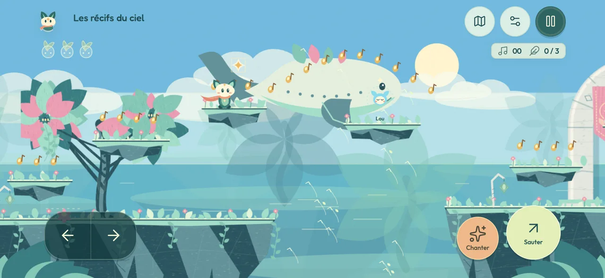
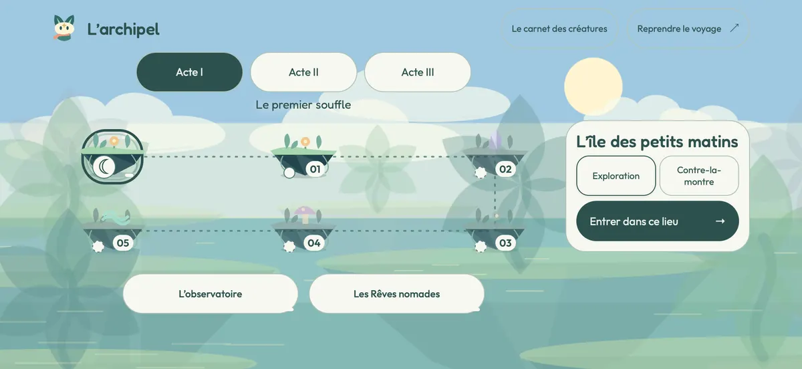

# LUMEN



**Lumen est le petit renard à l'écharpe. LUMEN est son aventure.**

L'île des petits matins est le premier écran : une île vivante, déjà jouable.
Le titre et l'invitation s'effacent au premier déplacement. Aucun menu à
traverser, aucun compte, aucune connexion requise.

Ouvrir [index.html](index.html), ou [LUMEN.html](LUMEN.html) pour l'édition
autonome. Les deux fonctionnent en `file://`, sans serveur ni construction
préalable. Sur iPhone et iPad, le projet **Capacitor 8** embarque le même jeu
hors ligne dans une app plein écran. Il se lance depuis Xcode ; le workflow
TestFlight est disponible pour un compte Apple Developer configuré.

[Guide du jeu](docs/guide-du-jeu.md) · [Dernière itération](docs/iteration-11/README.md) ·
[Installation iOS et TestFlight](docs/iteration-08/README.md)

## Une Entrée, Plusieurs Destinations

**Un seul atlas des lumières rassemble tout le voyage.** Trois constellations
relient les trois îles aux stages de campagne. Chaque île est une étape de
repos, sans créature hostile : île 1 → acte I → île 2 → acte II → île 3 →
acte III → finale. L'observatoire et les Rêves nomades restent hors du chemin
obligatoire. La quête de la coupole reste nécessaire pour entrer dans les Rêves.

La carte s'ouvre uniquement sur demande, depuis le jeu, la pause ou une fin
de lieu. Elle suspend une île ou un chapitre et permet de le reprendre.
Choisir une lumière montre son nom, sa progression et, si elle dort encore,
la condition qui l'ouvre. Les fragments et les détours restent facultatifs.
Les succès ajoutent de petites lumières ; une partie moins réussie ne les
retire jamais. Les passages secrets sont désormais mémorisés par stage.

Sur téléphone, on change explicitement de constellation avec les boutons
d'acte. Au clavier ou à la manette, les directions parcourent les lieux et
les actions ; Entrée/A choisit, Échap/B revient. Un lieu verrouillé reste
consultable. Les îles déjà terminées et les chapitres historiquement ouverts
restent accessibles lors de cette nouvelle organisation.



Chaque lancement revient à l'île 1, même pour un profil avancé. Les îles
déverrouillées, souvenirs et records restent dans l'atlas. La position au
milieu d'une île n'est pas sauvegardée. Ajouter `?classic` à l'adresse garde
l'entrée directe de développement dans la campagne.

### Le Chant Des Îles

Lumen retrouve les neuf voix d'Auralis. Chaque île contient trois échos et
trois souvenirs facultatifs. L'appel de Résonance retrouve les échos ; les
trois voix réunies ouvrent le passage. Les compagnons suivent ensuite Lumen,
enrichissent la musique et font refleurir le paysage.

| Île | Décision propre au lieu |
| --- | --- |
| L'île des petits matins | Découvrir le vol, les notes et le premier appel. |
| Les récifs du ciel | Inverser par l'appel un courant latéral pour traverser ou revenir vers une corniche. |
| Le grand chœur | Poursuivre Nève ou couper son trajet entre deux corniches avant de l'appeler. |

Une note prise en vol rend le second saut disponible. À dix notes enchaînées,
Lumen gagne un peu de vitesse. Relâcher le saut replie les ailes et permet de
sortir d'un courant. L'introduction reste courte (4 200 unités, 73 notes).
Les Récifs et le Grand chœur sont prolongés : 8 900 / 9 300 unités et
146 / 154 notes. La dernière voix attend dans leur nouvelle portion.

**Balade** revient au dernier sol stable après une chute et laisse quatre
secondes entre deux notes. **Élan** revient à la dernière lanterne, ramène
l'intervalle à 2,5 secondes et conserve un chrono personnel. Chaque chute
consomme une vie ; les échos restent retrouvés tant que la tentative continue.
À zéro vie, il faut recommencer l'île. Changer de rythme la recommence après
confirmation ; leurs records sont séparés.

### Les Jardins Et Les Rêves

La campagne compte **dix-sept chapitres**, secrets, lanternes, médailles et
contre-la-montre. Après les Prairies d'aurore, les seize autres jardins
possèdent une seconde portion avec terrasses, détours et lanternes. La caméra
suit aussi les montées et descentes. Le même Lumen porte les quatre pouvoirs temporaires :
`bloom`, `breeze`, `comet`, `echo`. Halos, expiration, glissade, ruée, dégâts
et défaite ont un dessin commun. Le vol plané reste propre au Chant.

L'atlas réunit **22 lieux** : 17 stages, 3 îles, l'observatoire et l'entrée
des Rêves. Les six nouveaux stages utilisent la Résonance disponible dès le
départ ; aucun pouvoir temporaire n'est requis pour les terminer.

| Acte | Nouveau lieu | Décision |
| --- | --- | --- |
| I | Sur le dos d'un songe | Voyager sur une créature apaisée, puis quitter son dos pour les détours. |
| I | Le petit astre égaré | Éclairer la route devant un astre autonome, puis revenir le chercher. |
| II | Le pont des veilleurs | Entretenir une chaîne de chants avant de s'engager sur son pont. |
| II | La rivière sans lune | Relayer l'appel au-dessus de l'eau et retrouver trois reflets. |
| III | La colonne des saisons | Monter de palier en palier, avec tremplins et plateformes mobiles. |
| III | Là où pleut la lumière | Déplacer une pluie qui fait pousser des appuis temporaires. |

Les lieux changent de composition : dos d'une créature, jardin nocturne,
viaduc vivant, rivière de reflets, colonne verticale et jardin sous la pluie.
Les [notes de conception](docs/iteration-06/stages.md) expliquent chaque choix.

À l'observatoire, les trois carillons rendent son souffle à la coupole.
Cette quête ouvre les Rêves nomades, même lorsqu'on passe par un menu.
Vesper et Ombeline conservent leurs dialogues. Une expédition comprend cinq
salles, des choix de routes, un refuge enregistré et un gardien. Sa graine
permet de rejouer la même nuit. Les améliorations des souvenirs restent
reportées, comme indiqué dans le [backlog](BACKLOG.md).

### Trois vies par tentative

Chaque île et chaque chapitre commence avec **3 vies**, affichées `×3` près
du portrait. Les **trois cœurs** représentent les dégâts que Lumen peut
encaisser avant de perdre une vie ; une chute dans le vide en coûte une.

Deux petites effigies de Lumen marquées **+** se trouvent dans chaque stage.
Chacune ajoute une vie, jusqu'à neuf. Une effigie ramassée ne réapparaît pas
au drapeau ; les vies gagnées ne passent pas au stage suivant. À zéro, un
menu court propose de recommencer le stage avec trois vies ou de revenir
à l'atlas. Les lieux déjà terminés, découvertes enregistrées et records restent
acquis. Les notes ne donnent plus de vies dans les chapitres.

Les Rêves nomades conservent leurs règles propres : trois vies pour toute
l'expédition, sauvegarde au refuge et bonus de vie toutes les quarante notes.

Dans **La rivière sans lune**, ce sont les trois grandes fleurs appelées par
Résonance qui ouvrent la porte. Les fragments sont facultatifs. Les ponts se
réveillent depuis les deux rives et les dernières terrasses se remontent avec
le saut normal. La porte fermée rappelle les trois fleurs avec des pictogrammes.

## Commandes Et Réglages

| Action | Clavier | Tactile | Manette en jeu |
| --- | --- | --- | --- |
| Avancer | Flèches, Q/D ou A/D | Flèches | Stick ou croix |
| Sauter | Espace, Z, W ou haut | Sauter | A ou B |
| Second saut / vol du Chant | Appuyer à nouveau / maintenir | Même bouton de saut | Même bouton de saut |
| Résonance / pouvoir | X ou J | Étincelles | X |
| Courir | Maj | Maintenir une direction | Gâchette ou épaule droite |
| Glisser dans les jardins | Bas en courant | Bas | Bas |
| Pause | Échap ou P | Pause | Start |
| Recommencer / son | R / M | Menus | Menus non intégralement validés |

Les commandes tactiles acceptent le glissement du pouce entre les directions
et deux appuis simultanés. Les réglages et la pause restent dans les zones
sûres de l'écran. Sur iOS natif, sélection, zoom accidentel et rebond sont bloqués.
Les panneaux de pouvoir sont supprimés ; une fin montre les souvenirs et les
actions pour continuer, sans tableau de statistiques.

La **palette claire est toujours active**, indépendamment du système. Les
anciennes préférences sombre/système sont normalisées sans effacer la
progression. Fredoka et Outfit sont locales ; les polices arabes et chinoises
de l'appareil prennent le relais.

Le français, l'anglais, l'espagnol, l'arabe et le chinois simplifié couvrent
menus, niveaux, dialogues et noms accessibles. **Lumen** reste identique
dans les cinq langues. La première langue compatible du navigateur est
choisie, avec repli anglais. Un choix manuel est conservé. Le RTL n'inverse
ni le monde, ni les directions, ni les graines.

Trois partitions originales sont synthétisées par Web Audio. Le mixage
sépare musique, effets et ambiance. **Écouter LUMEN** fonctionne aussi en
pause. L'audio commence après interaction et respecte le mode silencieux.
Aucune ressource n'est téléchargée en jeu.
Main dominante, taille des commandes et mouvements réduits sont mémorisés.

## Sauvegardes

Les clés `lumen.gardens.v1`, `lumen.gardens.v2`, `lumen.gardens.v3`, les clés
de chapitres et de transformations restent inchangées. La migration conserve
la source historique et les copies défensives protègent les profils valides.
Les sessions `song`, `campaign`, `hub` et `expedition` restent distinctes.

Le stockage dépend du navigateur, de l'origine ou du chemin local. Déplacer
le fichier ou changer de navigateur ne transfère pas automatiquement la
progression. Un stockage refusé n'empêche pas de jouer, mais interdit sa
conservation. Le joueur ou le système peut effacer les données du navigateur.
Dans l'app iOS, un miroir dans les fichiers de l'app protège la sauvegarde
contre une éviction du stockage WebKit. L'origine `capacitor://localhost`
est gelée. Installer par-dessus l'app conserve la progression ; la désinstaller
peut la supprimer. Il n'existe ni compte, ni serveur, ni synchronisation entre appareils.

## Construire, vérifier et installer

Node **22 ou plus** est requis pour Capacitor 8.

```sh
npm ci
npx playwright install chromium webkit
npm run verify
npm run test:browser:webkit
npm run test:places
```

Le build produit `LUMEN.html` et `dist/index.html`, identiques et autonomes.
`verify` couvre les suites de logique, stockage, rendu, audio, langues, poids,
parcours et navigateur Chromium. WebKit exécute les mêmes suites navigateur.
Les tests mobile couvrent six formats iPhone/iPad, français et arabe, zones
sûres, commandes simultanées, caméra, fins et défaite sans défilement.

Le retour complet dans la rivière, les 16 prolongements dans les deux sens,
les 40 vies ramassables et leur consommation font partie de `npm test`.
Voir le [rapport de l'itération 11](docs/iteration-11/README.md).

Sur un Mac avec Xcode, pour réinstaller sur son iPhone branché :

```sh
npm run ios:sync
npx cap open ios
```

Choisir **LUMEN → votre iPhone**, garder son équipe de signature, puis **⌘R**.
Le test personnel par Xcode reste possible sans abonnement payant ; TestFlight
nécessite l'adhésion. Ne pas désinstaller l'app pour la mettre à jour.

### Jouer sans notifications sur iOS

L'app déclare sa compatibilité avec le **mode Jeu**, dont iOS décide
l'activation. Ce mode améliore les ressources disponibles et la latence ; il
ne configure pas la Concentration à votre place. Pour filtrer les notifications :
**Réglages → Concentration → + → Jeu vidéo**, puis **Ajouter un programme →
App → LUMEN**. Choisir les personnes et applications autorisées.
Voir le [guide détaillé](docs/guide-du-jeu.md#iphone--mode-jeu-et-notifications)
et [l'aide Apple](https://support.apple.com/fr-fr/guide/iphone/iphd6288a67f/ios).

Les retours de jeu sur **iPhone 16 Pro Max**, jusqu'à l'acte II, guident ces
itérations. Les parcours automatisés prouvent la franchissabilité et les
règles ; ils ne mesurent ni le plaisir, ni les FPS, ni la batterie sur appareil.

## Organisation Et Licences

| Fichier | Responsabilité |
| --- | --- |
| [js/song.js](js/song.js) | Îles, échos, enchaînements et leurs deux décisions nouvelles. |
| [js/engine.js](js/engine.js) | Simulation, collisions et sessions existantes. |
| [js/levels.js](js/levels.js), [js/places.js](js/places.js) | Données des niveaux et règles des six nouveaux lieux. |
| [js/journey.js](js/journey.js), [js/journey-ui.js](js/journey-ui.js) | Accès, lumières et navigation de l'atlas commun. |
| [js/world-art.js](js/world-art.js) | Palettes, facettes, terrains, feuillages, nuages, mer et notes partagés. |
| [js/place-art.js](js/place-art.js) | Composition et décor vivant propres aux six lieux. |
| [js/song-art.js](js/song-art.js) | Dessin unique de Lumen et composition du Chant. |
| [js/renderer.js](js/renderer.js) | Jardins, coupole, créatures et Rêves. |
| [js/song-ui.js](js/song-ui.js), [js/ui.js](js/ui.js) | HUD, résultats et menus du Chant et des jardins. |
| [js/save.js](js/save.js) | Contrat historique de stockage et migration défensive. |
| [journey.css](journey.css), [song.css](song.css), [style.css](style.css) | Carte, interface commune et mises en page. Le tactile est dans `play.css`. |
| [tools/build.cjs](tools/build.cjs) | Génération du portable, jamais édité à la main. |

### Ajouter un lieu

Dans `js/levels.js`, conserver les helpers `ground`, `ledge`, `enemy`,
`coins`, `arc`, `item`, `checkpoint` et `secret`. Déclarer une **nouvelle clé
stable**, un `journeyAct` de 1 à 3, le point de départ, la sortie, les surfaces,
les objets et les indices. Ne jamais renommer une clé publiée ni utiliser la
position dans le tableau comme identifiant de sauvegarde. La carte recalcule
ses lieux et ses totaux depuis les données.

Les situations particulières déclarent `place.kind`. Leur état de visite est
créé dans `LumenPlaces.create()`, mis à jour avant/après la physique et remis
en état au respawn. Le dessin lit cet état dans `place-art.js` et ne modifie
jamais les collisions. Les textes rejoignent les cinq colonnes des catalogues
`locales-*.js`. Ajouter un parcours par entrées réelles dans les deux sens, vérifier les vies
ramassables et les petits écrans, puis lancer `npm run verify` et WebKit.

Ressources embarquées : [Fredoka](assets/LICENSE-fredoka.txt) et
[Outfit](assets/LICENSE-outfit.txt), SIL Open Font License 1.1 ;
[Lucide](assets/LICENSE-lucide.txt), ISC. Dessins et partitions sont locaux.
Cette itération n'ajoute aucune ressource externe, aucun backend, Angular,
3D ou multijoueur.
