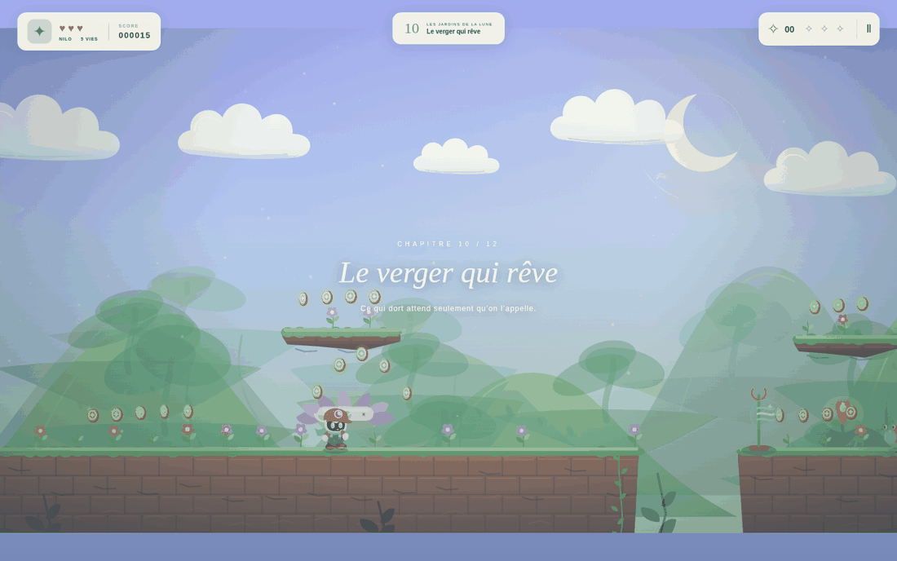
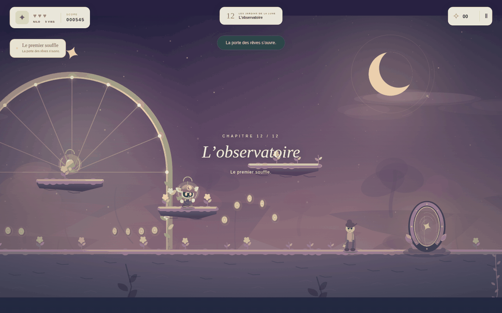
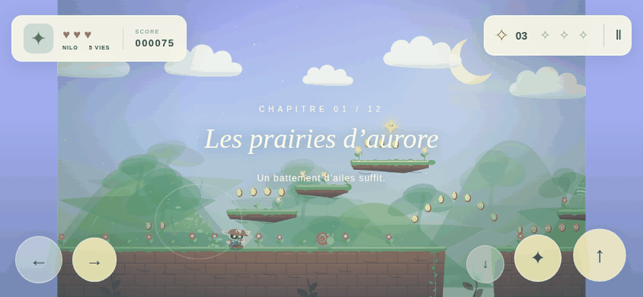

# LUMEN — Les jardins qui rêvent



> Le jour, tu répares un monde. La nuit, ce monde rêve de nouvelles aventures.

Un jeu de plateforme-aventure 2D original. Nilo, un petit gardien ailé, a une
voix : une onde qui réveille ce qui dort dans les jardins de la lune. Onze
chapitres écrits à la main, un observatoire où l'on parle à deux personnes, et
des expéditions nocturnes qui n'existent qu'une nuit — sauf si vous notez leur
graine.

Aucune dépendance à l'exécution, aucune requête réseau, aucun compte.
**Ouvrez `index.html`** dans un navigateur récent, ou `LUMEN.html` si vous
préférez un fichier unique à transmettre.

---

## Jouer

| Action | Clavier | Manette | Tactile |
| --- | --- | --- | --- |
| Se déplacer | ← → · Q D · A D | Stick / croix | ← → |
| Sauter / nager | Espace · ↑ · Z · W | A / B | ↑ |
| **Appeler (Résonance)** | **X · J** | **X** | **✦** |
| Courir | Maj | Gâchette droite | *maintenir une direction* |
| Glisser | ↓ · S | Bas | ↓ |
| Pause · Recommencer · Son | Échap/P · R · M | Start | bouton pause |

Un appui court fait un petit saut ; un appui long donne de la hauteur. Les
lanternes mémorisent votre passage. **Sur écran tactile, le chemin principal ne
demande jamais plus de deux doigts** : une direction et un bouton. La course
vient du maintien, pas d'un troisième appui.

---

## La Résonance

C'est le verbe central, et il est **toujours disponible** : pas un pouvoir, pas
une ressource, rien qui puisse expirer au mauvais moment. Une onde part de
Nilo et réveille ce qu'elle touche, pendant quelques secondes.

Quatre natures de réveil, délibérément différentes les unes des autres :

| Ce qui dort | Ce qui arrive | À quoi ça sert |
| --- | --- | --- |
| **Un bouton floral** | Il s'ouvre en tremplin (7 s) | Monter |
| **Un pont lunaire** | Il se matérialise (6 s) | Traverser |
| **Un carillon** | Il **relaie l'onde** depuis sa place | Atteindre ce qui est hors de portée |
| **Une créature endormie** | Elle se dresse et se tient tranquille (8 s) | Marcher sur son dos |

Le carillon est la pièce qui empêche la Résonance de n'être qu'une clé ouvrant
des portes identiques : il transforme la portée en énigme. Dans « Le verger qui
rêve », un gouffre reste infranchissable tant qu'on n'a pas compris qu'il faut
passer par lui — et le test le prouve dans les deux sens.

**Trois règles, tenues par `js/resonance.js` :** chaque élément annonce sa
nature avant d'être touché ; chaque réveil clignote avant de s'éteindre ; et
**ré-émettre prolonge**, ce qui garantit qu'un effet expiré ne piège jamais
personne — on peut rallumer un pont sous ses propres pieds.

### La créature apaisée

Trois durées, nommées dans `engine.js`, et qui sont une promesse faite au
joueur au moment où il appelle :

| | |
| --- | --- |
| `CALM_TIME` | **8 s** d'apaisement, quoi qu'il arrive |
| `CALM_WARNING` | **1,5 s** avant la fin, la créature se regonfle en pulsant |
| `CALM_GRACE` | **1,5 s** de répit après le réveil, avant qu'elle puisse charger |

Apaisée, elle s'aplatit et un liseré clair souligne son dos : la marche est
**dessinée**, pas devinée, et l'avertissement de fin est une **forme** — donc
lisible sans son et sans distinction de couleur. Une nouvelle onde prolonge
sans jamais raccourcir. Ces durées n'appartiennent qu'à `updateResonance` ;
aucun autre minuteur du moteur ne peut les abréger, ce que `tests/test-p0.cjs`
vérifie avec des minuteurs internes valant `0,9`, `0`, `−5` et `−120`.

### Les pouvoirs amplifient, ils ne remplacent pas

Le bouton action reste le même, quoi que vous portiez. Les pouvoirs historiques
gardent exactement leur effet et l'ajoutent à l'onde :

| Pouvoir | Ce que X fait alors |
| --- | --- |
| *(aucun)* | Onde de base, portée 180 px |
| Grelot d'écho | Portée ×1,8, **et** les plateformes d'écho se révèlent 4 s |
| Fleur solaire | Une graine de lumière part avec l'onde |
| Cœur comète | L'onde vous propulse |
| Plume d'azur | Inchangée : elle vit sur le bouton saut |

Un seul changement pour qui connaissait le jeu : X, qui n'affichait qu'un
message quand on ne portait rien, fait désormais quelque chose.

---

## Deux façons de jouer

### Les jardins de la lune — la campagne

Onze chapitres écrits à la main, chacun lançable en **Exploration** ou en
**Contre-la-montre** : même niveau, le chrono en plus et un meilleur temps
personnel enregistré. Aucun compte à rebours, aucune pénalité à flâner.

Les **médailles** récompensent la maîtrise, pas la seule vitesse : l'or demande
les trois fragments, au plus un dégât, et le temps d'or. Les objectifs de temps
sont larges — une course directe traverse le premier chapitre en une dizaine de
secondes pour un objectif d'or à 1:10 — donc la vraie exigence est de réunir
les fragments, qui sont tous sur des détours. La course pure se joue sur le
record personnel.

### Les rêves nomades — les expéditions


Cinq salles, une carte à embranchements, un refuge au milieu, un gardien au
bout. Chaque salle est **assemblée** à partir de fragments écrits à la main, et
vérifiée avant d'être jouée. Une nuit se note par sa graine : `verger-lune-lune-0`
redonne exactement la même nuit, chez vous comme chez quelqu'un d'autre.

Deux emplacements de souvenirs seulement, pour quatre souvenirs possibles :
chaque ramassage est un choix, et deux d'entre eux forment une combinaison
(la corolle et le souffle d'azur permettent de monter de saut en saut).

### L'observatoire



Le seul lieu où l'on ne peut pas mourir. Vesper y tient le carnet, Ombeline y
garde la porte des rêves. Une quête courte — réveiller les trois carillons de
la coupole — ouvre cette porte, et **allume la coupole pour de bon**.

Cette quête est **la seule règle d'accès aux Rêves nomades** : le portail de
l'observatoire et l'entrée du menu consultent tous deux `canEnterDreams()`. Le
menu ne peut donc pas ouvrir ce que la porte garde fermé ; quand il refuse, il
dit pourquoi et conduit le joueur à l'observatoire. Une porte franchie le reste
: `restoreWorldState()` rouvre à chaque chargement ce qu'une quête achevée
avait ouvert, sans qu'aucun carillon ait à être réveillé de nouveau.

### Où l'on se trouve : `game.session`

La session est un **état déclaré**, pas une déduction :

| `session` | Ce que cela veut dire |
| --- | --- |
| `home` | l'accueil, ou rien en cours |
| `campaign` | un chapitre de campagne |
| `hub` | l'observatoire |
| `expedition` | une nuit en cours |

Les transitions sont explicites : `start()` et `showMap()` quittent une nuit,
`leaveExpedition()` l'abandonne, `retryExpedition()` la recommence avec sa
graine, et `startExpedition({ resumed: true })` ne compte pas une tentative de
plus. C'est ce qui garantit qu'une nuit ne gouverne jamais un chapitre — ni sa
mort, ni son réessai, ni sa sortie, ni les souvenirs portés.

---

## Architecture

Scripts classiques chargés dans l'ordre par `index.html`. Cette organisation
conserve l'ouverture directe en `file://` : pas de serveur, pas de compilation.
Graphismes et audio sont générés par le code, sans aucune ressource externe.

| Fichier | Rôle | DOM / Canvas |
| --- | --- | --- |
| `js/rng.js` | Aléatoire versionné à flux séparés, graines lisibles | non |
| `js/save.js` | Profil, schéma v3, migration, validation | non |
| `js/resonance.js` | Règles de la Résonance et des réveillables | non |
| `js/modules.js` | Les fragments de salle écrits à la main | non |
| `js/expedition.js` | Plan d'expédition, directeur de rythme, inspection | non |
| `js/upgrades.js` | Souvenirs, emplacements, plafonds, combinaisons | non |
| `js/levels.js` | Les onze chapitres et l'observatoire | non |
| `js/engine.js` | Simulation à 120 Hz, entrées, collisions, progression | non |
| `js/renderer.js` | Décors, personnages, lumière | Canvas |
| `js/audio.js` | Musique et bruitages synthétisés | Web Audio |
| `js/ui.js` | Menus, HUD, dialogues, tactile | DOM |

**Les sept premiers modules n'ont besoin ni du DOM, ni de Canvas, ni de Web
Audio** : c'est ce qui rend la simulation entièrement testable en Node, et c'est
une contrainte à préserver.

---

## La génération des expéditions

### Quatre flux, jamais mélangés

`js/rng.js` dérive d'une seule graine quatre générateurs indépendants :
`layout` (disposition), `events`, `rewards` et `cosmetic`. **Consommer le flux
cosmétique ne peut pas déplacer une plateforme** — le test l'établit en épuisant
cinq mille tirages cosmétiques et en retrouvant la disposition au pixel près.
Un nom de flux inconnu lève une erreur plutôt que de créer un flux fantôme.

`GENERATION_VERSION` accompagne chaque graine sauvegardée : une nuit rêvée dans
une version antérieure n'est pas reprise en silence, elle est refusée et
expliquée.

### Des modules annotés, pas des salles improvisées

Chaque module de `js/modules.js` déclare ce que le générateur a le droit d'en
faire :

```js
{
  id: 'carillon-hors-portee', kind: 'puzzle', width: 900,
  entry: 600, exit: 520,          // les hauteurs de surface aux deux bords
  requires: ['resonance'],         // ce qu'il faut savoir faire pour le traverser
  provides: [],                    // ce qu'il donne au passage
  cost: 2,                         // budget de difficulté, 0 à 3
  tags: ['puzzle', 'vertical'],    // ce qu'il contient
  forbidWith: ['puzzle'],          // ce qu'il refuse comme voisin
  note: '…',                       // l'intention, en français
  build(x, rng) { /* géométrie absolue */ }
}
```

Un raccord n'est valide que si la marche entre deux bords tient dans un saut
ordinaire : au plus 90 px pour monter, 220 px pour descendre.

### Ce que la génération garantit

Chaque garantie ci-dessous correspond à un contrôle nommé dans
`tests/test-expedition.cjs` :

- **même graine + même version + mêmes choix ⇒ même gameplay**, et un choix
  tardif ne récrit jamais les salles déjà traversées ;
- **aucun module n'exige une capacité que le joueur n'a pas encore** — c'est le
  contrôle de dépendance qui interdit la clé derrière sa propre porte ;
- **tout raccord est franchissable**, et chaque module pose une surface sur ses
  deux bords dans les 120 variantes testées ;
- **aucun trou n'excède ce que la physique franchit** : la constante
  `MAX_WALK_GAP` est comparée à une mesure faite sur le vrai moteur ;
- **aucun danger ne surplombe le vide** ;
- **les tentatives sont bornées** (24), et un couloir de repli toujours valide
  existe — une génération ne peut pas échouer à produire une salle jouable ;
- **chaque branche de la carte est annoncée** avant qu'on s'y engage.

### Une branche est une décision, pas une étiquette

Quatre garanties supplémentaires, vérifiées par `tests/test-p0.cjs` sur un
corpus de 120 graines (600 salles, 360 choix) :

- **deux alternatives produisent deux salles réellement différentes** — pas
  seulement deux libellés ;
- **la nature annoncée est la nature jouée** : le module final de la chaîne
  *définit* la salle, et c'est lui que la carte nomme ;
- **une alternative proposée est toujours réalisable** : chaque nature possible
  est assemblée pour de bon, dans son propre sous-flux, avant d'être offerte.
  Ce qui ne s'assemble pas n'apparaît pas ;
- **l'intention de rythme reste une contrainte distincte du type choisi** :
  choisir « un chemin » dans une salle de tension n'ouvre pas le catalogue de
  découverte.

La géométrie d'une salle ne dépend que de `(graine, indice, nature)`.
L'invariant « un choix tardif ne récrit pas une salle déjà traversée » n'est
donc pas seulement testé : il est structurel.

Le directeur de rythme suit une intention par salle — découverte, tension,
repos, tension, final — et ne choisit, dans chaque cas, que parmi des natures
prévalidées, en évitant ce qui vient d'être vu.

Mesure sur 400 graines (2 000 salles) : **aucun repli**, et **1 200 salles
offrant deux alternatives** — soit toutes celles qui ne sont ni un refuge ni
l'arène du gardien.

---

## La sauvegarde

Trois règles gouvernent `js/save.js` :

1. **Rien n'est indexé par position de tableau.** Un chapitre est désigné par une
   clé stable (`prairies-aurore`, `verger-qui-reve`…). Insérer un chapitre au
   milieu de la campagne ne déplace donc plus le record de personne — ce que le
   onzième chapitre, inséré avant la finale, démontre en pratique.
2. **Une sauvegarde ancienne n'est jamais effacée.** Une v1 ou v2 est migrée
   vers le schéma v3 et **l'originale reste sur le disque** ; la version
   précédente de la v3 est conservée comme copie de secours, et sert
   automatiquement si le fichier courant devient illisible.
3. **Une donnée illisible ne fait pas perdre le reste.** La validation répare
   champ par champ, et un stockage indisponible laisse le jeu parfaitement
   jouable — seule la persistance est perdue, et le joueur en est averti.

Le profil v3 contient : les chapitres par clé, les chapitres ouverts, les
réglages, l'état des quêtes et des transformations, le carnet, les statistiques
d'expédition, et l'expédition en cours — graine, version de génération, salle,
route, souvenirs, **et la liste des récompenses déjà encaissées**, qui est le
verrou empêchant une reprise de refuge de payer deux fois.

---

## Vérifier

Toutes les commandes se lancent depuis le dossier `LUMEN`. Le jeu n'a besoin de
rien ; ce qui suit ne sert qu'au développement.

```bash
node tools/build.cjs          # régénère LUMEN.html (aucun paquet requis)

node tests/test-p0.cjs            # 28 promesses du jalon A (branches, apaisement,
                                  #   restauration du monde, sessions, sauvegarde)
node tests/test-engine.cjs        # 49 contrôles de physique et de progression
node tests/test-renderer.cjs      #  9 contrôles de dessin
node tests/test-expedition.cjs    # 15 invariants de génération, dont 1000 graines
node tests/playthrough.cjs        #  6 parcours joués avec de vraies entrées

npm install                   # uniquement pour les tests navigateur
npx playwright install chromium
npm run test:browser          # 10 contrôles dans un vrai navigateur, en file://

npm test                      # les cinq suites Node
npm run verify                # build + tests Node + navigateur
```

Le navigateur est résolu sans aucun chemin absolu : `LUMEN_CHROMIUM` si vous en
désignez un, sinon le cache Playwright, sinon celui de Playwright lui-même.

### Résultats réellement obtenus

Relevés à la dernière exécution complète, sur Node 22 et Chromium en conteneur
Linux :

| Suite | Résultat |
| --- | --- |
| `test-p0.cjs` | 28 / 28 (3 / 28 avant le jalon A — voir `docs/jalon-a-reference.json`) |
| `test-engine.cjs` | 49 / 49 |
| `test-renderer.cjs` | 9 / 9 |
| `test-expedition.cjs` | 15 / 15, dont 1 012 graines sans une seule salle fautive |
| `playthrough.cjs` | 6 parcours terminés, dont « Le verger qui rêve » en 13,4 s |
| `test-browser.cjs` | 10 / 10, zéro erreur de console |

Quelques mesures que ces suites produisent, et qui disent quelque chose :

- le chapitre de la Résonance est **terminé au clavier par un pilote
  automatique**, en utilisant ses onze réveillables et un relais de carillon ;
- une **nuit entière** est menée par l'interface — cinq salles, choix de route,
  souvenirs dans la limite des deux emplacements, refuge enregistré, gardien
  atteint ;
- le plus grand trou franchi en courant par la vraie physique est de **250 px**,
  et le générateur n'en produit jamais de plus larges sans pont ;
- une nuit est **quittée par les menus** puis un chapitre est **joué jusqu'à sa
  sortie**, sans qu'aucun souvenir de rêve n'agisse et sans qu'aucun écran de
  route ne s'ouvre.

### Limites, et ce qui n'est pas testé

Dit sans emballage, parce que c'est ce qui compte :

- **aucun playtest humain n'a eu lieu.** Tout ce que ce document affirme sur le
  plaisir ou la lisibilité est une hypothèse ;
- **aucun doigt humain n'a touché les commandes tactiles.** Elles sont vérifiées
  par un navigateur qui simule le tactile : cibles ≥ 48 px, trois doigts
  simultanés, aucun doigt collé après annulation. C'est nécessaire, pas
  suffisant ;
- **la cadence n'est pas mesurée sur un vrai appareil.** Le chiffre relevé par
  `npm run test:browser` vient d'un Chromium logiciel en conteneur partagé, où
  le même code a donné 23 i/s puis 38 i/s à quelques minutes d'intervalle. Il
  ne sert qu'à repérer un effondrement entre deux exécutions, et ne valide
  aucune cible de performance ;
- **l'audio n'a aucun test.** Il est simulé partout ;
- **le rendu est testé contre un canevas factice** : cela prouve qu'aucune
  routine ne manque et qu'aucun NaN ne passe, pas que l'image est juste ;
- **les 1 000 graines contrôlent des invariants géométriques, pas le plaisir.**
  Une nuit peut être parfaitement valide et parfaitement ennuyeuse.

- **la nouvelle posture de la créature apaisée n'a été vue par personne** : le
  test de rendu prouve qu'elle se dessine sans erreur, pas qu'elle se lit.

`BACKLOG.md` détaille ce qui reste à faire, et rien de ce qui est déjà fait.
`docs/audit-iteration-04.md` dit, constat par constat, ce qui a été confirmé et
ce qui a été **réfuté** — deux constats du cahier des charges l'ont été.

---

## Ajouter du contenu

### Un chapitre

Ajoutez une définition à `levels` dans `js/levels.js`. Une **clé stable et
unique** est obligatoire : c'est le contrat avec les sauvegardes existantes.
`medalTargets: { gold, silver }` l'est aussi, en secondes.

Les coordonnées sont en pixels du monde, l'axe Y descend. Plateformes, zones et
ennemis utilisent leur coin supérieur gauche ; les collectibles et **les
réveillables utilisent leur centre** — pour un pont, c'est son milieu, ce qui
détermine d'où on peut l'appeler. Le sol usuel commence à `y: 600`. Limitez les
montées obligatoires à 90–100 px et les trous ordinaires à 80–160 px.

```js
wakeables: [
  wake('bloom', 560, 550),                          // tremplin 60 px plus haut
  wake('bridge', 2140, 600, { span: 240 }),         // cœur au milieu du pont
  wake('chime', 2640, 520, { id: 'mon-carillon' })  // relais
]
```

Types de plateforme : `ground`, `solid`, `moving`, `crumble`, `vanish`,
`spring`, `conveyor`, `echo`. Thèmes : `meadow`, `cavern`, `tide`, `sky`,
`forge`, `frost`, `secret`, `eclipse`. Ajouter un thème implique une palette
dans le renderer, une entrée `GROUND_DUST` dans le moteur, et une variation
musicale.

`hub: true` sort un lieu de la campagne (ni médaille, ni chrono, ni décompte).
`bonus: true` marque un chapitre accessible en avance. `final: true` marque
celui qui termine l'aventure.

### Une créature

Contrat : `{ type, x, y, w, h, minX, maxX }`. Six comportements existent :

| Type | Comportement | Silhouette |
| --- | --- | --- |
| `patrol` | Va-et-vient au sol | Coquille spiralée |
| `hopper` | Bonds réguliers | Corps rond sur deux pattes |
| `turret` | Immobile, tire vers Nilo | Fleur sur une tige |
| `chaser` | Poursuite aérienne | Papillon de nuit |
| `sleeper` | Dort ; se réveille si Nilo s'attarde, puis charge | Monticule de mousse, œil ambre |
| `swarm` | Anneau de lucioles ; se **disperse** quand on saute dessus | Cinq lucioles ailées |

Deux détails comptent : **un dormeur endormi est inoffensif au contact** — ce
qui fait de l'attente une décision et non un obstacle — et **la Résonance le
réveille en douceur**, le transformant en marche plutôt qu'en menace.

### Un module d'expédition

Ajoutez une entrée à `MODULES` dans `js/modules.js` avec toutes ses annotations.
Les quatre invariants existants le valideront sans travail supplémentaire : la
présence d'une surface sur ses deux bords, la validité de ses raccords, le
respect des capacités, et la franchissabilité des salles qui l'emploient.

---

## Direction artistique

Nilo, les créatures, les architectures botaniques, les décors et les sons sont
originaux et dessinés ou synthétisés par le code. Chaque créature a une
silhouette qui lui est propre : aucune n'est la recoloration d'une autre.
Aucune ressource externe n'est utilisée, donc aucune licence tierce n'est en
jeu.

Le jeu respecte `prefers-reduced-motion` dès le premier lancement, et offre
trois réglages de confort : main dominante, taille des commandes tactiles, et
atténuation des secousses et des flashs. Les indications ne reposent jamais sur
la seule couleur : chaque état porte aussi une forme, une icône ou un mot.


