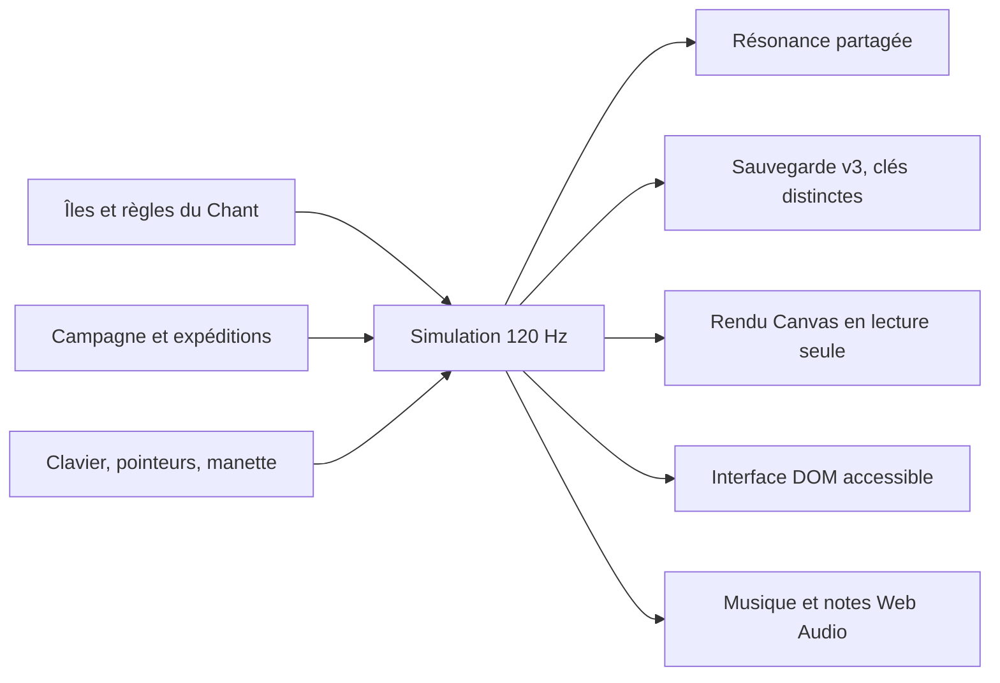

# Le Chant des îles — conception actuelle

Mis à jour après les retours iPhone et les itérations 09–11.
Les anciens rapports d’itération conservent leurs décisions historiques.

## Le Diagnostic

Le dépôt possédait une base solide : simulation à pas fixe, collisions
indépendantes du rendu, sauvegardes versionnées, campagne écrite à la main,
génération d’expéditions et tests de comportement. Une réécriture intégrale
aurait abandonné cette fiabilité sans garantir un meilleur jeu.

Le problème de direction était plus concret : le premier chapitre ressemblait
à un jeu de plateforme classique, tandis que la Résonance, son geste le plus
singulier, arrivait beaucoup plus tard dans la campagne. L’accueil expliquait
une aventure avant de la faire vivre. Le cadrage portrait conservait des
bandes inutilisées. Ces constats sont cohérents avec le backlog existant.

La réponse implémentée est une nouvelle aventure autonome dans le même jeu,
pas une promesse de succès commercial : **le mouvement compose la musique,
et la musique rassemble le monde**.

## Les Décisions

### Une Entrée Immédiate

Le premier écran est le monde jouable. Le personnage, les premières notes,
les chemins en hauteur et Pip sont présents dans l’ouverture. Les menus
restent disponibles, mais ne constituent plus le début obligatoire.

### Un Geste À Plusieurs Conséquences

Une note prise en l’air rend le second saut disponible, joue une note
harmonique et prolonge un enchaînement. Les notes servent donc de trajectoire,
de retour sonore et d’objectif de maîtrise. Elles ne sont pas consommées
deux fois après une chute.

Chanter retrouve un écho. Celui-ci suit Lumen, amplifie les appels suivants,
enrichit la musique, fait avancer le réveil du décor et contribue à ouvrir
la sortie. Les mêmes ondes réveillent aussi les fleurs, ponts et carillons
hérités du moteur classique.

### Une Tolérance Choisie

Balade et Élan partagent le même monde, mais pas la même tolérance. Balade
revient au sol stable le plus récent après une chute. Élan revient à la
lanterne et réduit la fenêtre des enchaînements. Tous deux commencent avec
**trois vies** : une chute en consomme une. Deux effigies de Lumen par île
donnent chacune une chance supplémentaire, jusqu’à neuf. Les compagnons et
les objets pris sont conservés entre les retours au sol, sans pouvoir
ramasser la même vie plusieurs fois. À zéro vie, il faut recommencer l’île
entière avec trois vies. Les records des îles déjà terminées restent acquis.

La même réserve par tentative s’applique aux dix-sept jardins. Les cœurs de
santé restent distincts des vies, affichées près du portrait. Les expéditions
gardent leur réserve sur toute une nuit et leur bonus de quarante notes.

La collection complète n’est pas obligatoire pour avancer : seuls les trois
échos ouvrent le passage ; les trois souvenirs sont des détours de maîtrise.
Les résultats des deux rythmes sont enregistrés séparément. Changer de rythme
demande confirmation et recommence l’île pour éviter de falsifier un record.

### Une Direction Artistique Locale

Les îles utilisent des silhouettes découpées, des roches facettées, des ruines
claires, des végétaux corail, un ciel d’aube puis de récif et de crépuscule.
Les décors structurants sont mis en cache ; le personnage, les compagnons,
les courants et le voyageur céleste restent animés.

Le monde occupe tout l’écran sans étirer les personnages. Les contrôles
s’adaptent au portrait et au paysage. Sur iPhone, l’app utilise le paysage.
La caméra suit les deux axes, avec une zone centrale stable et une anticipation
à la montée. Le voile de premier plan qui effaçait Lumen en hauteur est supprimé.
Les commandes et menus restent dans les safe areas, sans zoom ni sélection
accidentels dans l’app native.

### La couleur reste claire

La palette claire est désormais imposée, indépendamment du système. Le
réglage sombre/système a été retiré après le playtest iPhone : il dénaturait
les couleurs. Les préférences historiques sont normalisées sans toucher à
la progression. Les palettes de chaque biome gardent leur identité propre.

Les nouvelles matières donnent des repères d’échelle et de fabrication :
strates minérales, cernes de bois, pierre gravée et bannières brodées. Le
motif étoilé se retrouve dans les architectures, la tunique et les ailes.
Les textures sont discrètes sur les surfaces jouables et calculées en cache.

### Un Ensemble Qui Répond

Une phrase pentatonique de cinq notes relie les trois partitions aux petites
récompenses sonores du jeu. Cordes pincées, kalimba, souffle et chœur sont
synthétisés localement. Les compagnons ne déclenchent plus une simple fanfare
de collectible : leur réponse utilise la même gamme que l’île.

Le son environnemental traduit des informations physiques : vitesse dans le
vent, déploiement des ailes, altitude et position des cascades. Les trois
canaux indépendants permettent d’atténuer la musique sans perdre ces repères,
ou de garder seulement l’ambiance. La partition reste locale et respecte le
mode silencieux de l’iPhone.

L’immersion implique aussi le silence : aucune lecture avant le premier geste,
fondus courts à la pause, silence du mixage à zéro, voix et connexions bornées.
La démonstration dans les réglages est le seul son autorisé explicitement
pendant cette pause. Les échantillons sont mesurés dans un vrai moteur Web Audio,
mais cela ne remplace pas une séance d’écoute humaine.

### Du temps à jouer, peu de texte

Les deux dernières îles ont été prolongées à 8 900 et 9 300 unités ; leurs
nouvelles portions portent la dernière voix. La première reste à 4 200.
Les seize jardins après les Prairies ont eux aussi un second mouvement de
terrasses et de détours, avec des lanternes supplémentaires. Les grandes
descentes se remontent par des appuis intermédiaires au saut normal : explorer
ne doit pas exiger de sacrifier une vie pour revenir.

Le panneau de pouvoir a disparu. Les fins sont de petites célébrations avec
une action principale, sans grille de statistiques. Les informations de
santé, vies et objets restent discrètes dans le HUD. La porte de la Rivière
sans lune rappelle ses trois fleurs par des pictogrammes dans le décor.

## Les Contrats Préservés

- Aucun changement des clés des anciens chapitres ; l’atlas utilise ces clés stables.
- Aucun souvenir d’expédition actif dans une île du Chant.
- Aucune modification des sauts de la campagne classique.
- Aucun framework ou paquet requis pour jouer.
- Aucun service réseau, compte, classement public, achat ou télémétrie ajouté.
- Les licences des polices Fredoka et Outfit et des pictogrammes Lucide sont
  livrées avec les fichiers locaux.

## La Preuve Et Ses Limites

Le pilote de parcours connaît les lieux mais n’écrit jamais la position du
personnage, les objets collectés ou l’état de victoire. Il agit sur les mêmes
entrées que les commandes du jeu. Il termine les trois îles dans les deux
rythmes, sans chute, avec les neuf échos et les neuf souvenirs, et ne tient
jamais plus de deux actions simultanées.

Les tests navigateur vérifient également les vrais événements clavier et
pointeur, l’annulation des entrées, les menus, la persistance du confort,
l’enchaînement des îles, la coexistence avec les sauvegardes classiques et
l’édition hors ligne. Les cinq formats de capture incluent un téléphone de
320 pixels de large et un écran de 2560 pixels.

Ces tests prouvent la cohérence et l’accessibilité physique des parcours.
Ils ne prouvent pas que le jeu est amusant, intuitif pour un enfant ou assez
riche pour une sortie commerciale. Les trois îles constituent une petite
aventure complète et un terrain de playtest, pas un catalogue de contenu fini.

La prochaine décision doit venir de personnes qui jouent : un enfant avec
son adulte, un débutant sur téléphone et une personne habituée aux jeux de
plateforme. Observer le premier chant volontaire, la compréhension du
vol plané, les notes aériennes remarquées et l’envie de refaire un trajet.

La coquille Capacitor 8 pour iPhone/iPad est réalisée. Les retours humains
sur iPhone 16 Pro Max jusqu’à l’acte II ont motivé les itérations récentes.
Les tests couvrent désormais les trois vies, les ramassages et les menus de
défaite sous Chromium et WebKit, et un aller-retour complet dans la rivière.
Ils ne remplacent pas les contrôles physiques de fluidité, batterie, audio
après interruption, manette et lecteur d’écran.

Le mode Jeu est déclaré dans le projet iOS. Le filtrage des notifications
reste une Concentration configurée par le joueur, avec un programme lié à
LUMEN. Voir le [guide actuel](guide-du-jeu.md) et le
[rapport de l’itération 11](iteration-11/README.md).