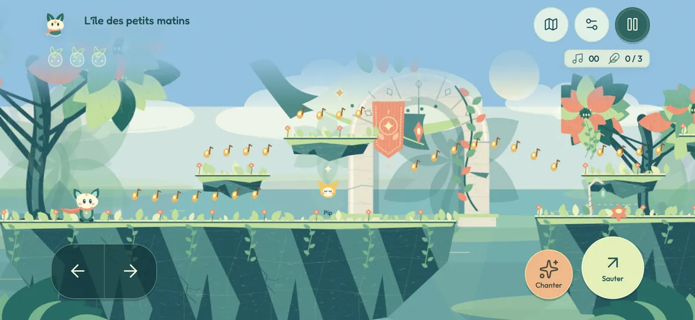
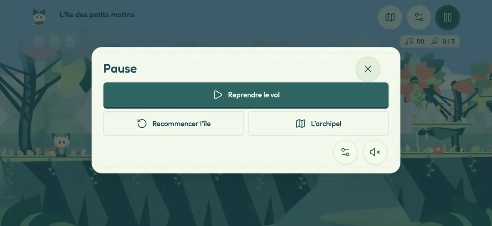

# Itération 09 — Jouer avec deux pouces

Le retour d’Omar sur iPhone montrait des défauts bloquants : sélection de la page, zoom bloqué, réglages hors champ, commandes difficiles et atlas trop long. Cette itération corrige le produit directement, à partir du dernier `origin/main` disponible (`567f0f4`) et des quatre commits natifs de l’itération 08, encore en PR. Branche : `codex/iteration-09-mobile`.

## Ce qui change

| Avant | Maintenant |
| --- | --- |
| Un appui prolongé sélectionne l’interface | Sélection, menu contextuel et gestes de zoom désactivés dans la coquille native, sur toute l’interface. Les deux chemins de démarrage UIKit utilisent `LumenViewController`. |
| Un double appui peut agrandir la page et couper les menus | Viewport fixe uniquement en natif, pincement désactivé dans WKWebView, gestes réservés aux commandes. L’édition web conserve son zoom accessible. |
| Petits boutons et HUD débordant | Cibles de menu de 48 px minimum, marges tenant compte des encoches et de l’indicateur d’accueil, réglages accessibles dans les îles comme les chapitres. |
| Deux flèches qu’il faut relâcher pour changer de sens | Pavé continu : glisser le pouce change de direction. Le second pouce peut sauter ou agir simultanément. Course après 380 ms de maintien. |
| Sauts difficiles à déclencher précisément au doigt | Sur saisie tactile, tolérance après le bord de 160 ms et mémorisation d’un saut avant l’atterrissage de 190 ms. Clavier inchangé. |
| Des textes et compteurs occupent le décor | HUD compact, indications clavier masquées sur tactile, toast raccourci à 2 s, introduction de chapitre à 1,1 s. L’aide tactile reste dans les réglages. |
| Atlas vertical à faire défiler | Un acte à la fois, miniatures d’îles avec repères de biome, chemins animés et ciel du jeu. Sélection et départ visibles ensemble. Les statistiques passent dans le carnet. Les 22 destinations restent présentes. |
| Le jeu continue à dessiner sous les menus | Scène figée en pause et derrière l’atlas, redessin à la rotation et au changement d’apparence. Ciel de l’atlas plafonné à 30 dessins/s. Résolution canvas mobile plafonnée à 1,5 au lieu de 2 (44 % de pixels de moins à taille identique). |

Les mouvements réduits immobilisent les décorations de la carte. Le mode gaucher, la taille des commandes, les cinq langues, l’arabe et les thèmes restent disponibles. Les clés de sauvegarde, le schéma `capacitor`, l’identifiant de l’application et les règles de progression restent identiques. Aucune dépendance ajoutée.

## Aperçus

Captures **WebKit sur Mac**, viewport iPhone paysage 956 × 440, gestes et pont natif simulés, marges latérales de 62 px et marge basse de 21 px. Ce ne sont pas des captures sur un iPhone physique.






## Validation reproductible

Résultat du 16 septembre 2026 : suites de logique vertes ; **30/30 navigateur + 6/6 atlas + 14/14 mobile**, sur Chromium et sur WebKit ; compilation iOS arm64 réussie. Images suivies : **4,6 Mio / 6 Mio** ; dépôt : **6,9 Mio / 12 Mio**.

- `npm run verify` : build autonome, suites de logique/rendu/sauvegarde et suites navigateur Chromium.
- `npm run test:browser:webkit` : suites navigateur, atlas et nouveaux tests mobiles sous WebKit.
- `npm run test:mobile` : six formats (956×440, 844×390, 667×375, 568×320, 768×1024, 1024×768), français/jour et arabe/nuit. Vérifie taille, position, absence de recouvrement et `elementFromPoint` pour les boutons ; ferme les réglages après défilement ; sélectionne chaque destination des trois actes sans déplacer l’atlas ; teste deux pointeurs simultanés, changement de direction, course, annulation et pause ; vérifie le budget de rendu et la conservation du zoom web.
- Compilation Xcode Debug pour iOS arm64 avec `CODE_SIGNING_ALLOWED=NO` : contrôle Swift, ressources et intégration native, sans utiliser de certificat personnel.
- Le test `file://` reconstruit aussi l’édition portable dans un dossier temporaire et la lance seule. Le test du poids garde les budgets de 6 Mio d’images et 12 Mio pour le dépôt.

Les tests ne mesurent pas la latence du vrai écran tactile, les FPS sur iPhone, les menus système iOS ni le confort des pouces. La compilation et les tests simulés complètent un essai physique ; ils ne le remplacent pas.

## Retester sur ton iPhone

Le dépôt local est déjà sur la nouvelle branche, et `npm run ios:sync` a préparé les fichiers dans le projet Xcode. Tes réglages personnels de signature sont conservés et ne font pas partie du commit.

1. Branche et déverrouille l’iPhone.
2. Dans le projet Xcode de `/Users/omartrabelsi/Repos/lumen/ios/App/App.xcodeproj`, garde le schéma **LUMEN** et sélectionne ton iPhone en destination.
3. Arrête l’ancienne exécution, puis **⌘R**. Cela remplace l’application existante. **Ne désinstalle pas LUMEN**, afin de conserver ta progression.
4. Repère les nouvelles commandes **Sauter / Chanter** et la carte en une seule vue : cela confirme que le bon build est installé.
5. Joue quelques minutes : maintiens une flèche, glisse vers l’autre sans lever le pouce, saute simultanément, puis chante. Essaie aussi le mode gaucher et la taille des commandes dans les réglages.
6. Fais plusieurs appuis rapides et prolongés sur le jeu, le HUD, la pause et l’atlas. Aucun zoom, sélection bleue ou menu Copier ne doit apparaître.
7. Ouvre les réglages en haut à droite, descends la liste et ferme-la avec la croix restée visible. Vérifie pause/reprise, rotation paysage dans les deux sens, arrière-plan/reprise et sauvegarde.
8. Dans l’atlas, change d’acte, sélectionne une étape, puis pars sans faire défiler la page. Vérifie aussi l’iPad en portrait et en paysage.

Pour resynchroniser après d’autres changements :

```sh
cd /Users/omartrabelsi/Repos/lumen
npm run ios:sync
```

## Brief conservé pour la suite

Priorité au jeu, au décor et à l’action immédiate. Deux pouces suffisent pour le chemin principal ; chaque geste doit être interrompable sans touche coincée. Toute nouvelle interface doit être testée à la hauteur réelle d’un iPhone paysage, avec les marges natives, et son action principale doit être visible sans défilement. Les informations secondaires vont dans un menu volontairement ouvert. Aucun test de présence dans le DOM ne suffit pour déclarer un bouton accessible.

Les API natives utilisées sont publiques : [limites de zoom WKWebView](https://developer.apple.com/documentation/webkit/wkwebviewconfiguration/ignoresviewportscalelimits) et préférence `isTextInteractionEnabled` (disponible depuis iOS 14.5, vérifiée dans les en-têtes du SDK installé). Aucun changement à la session audio iOS.
