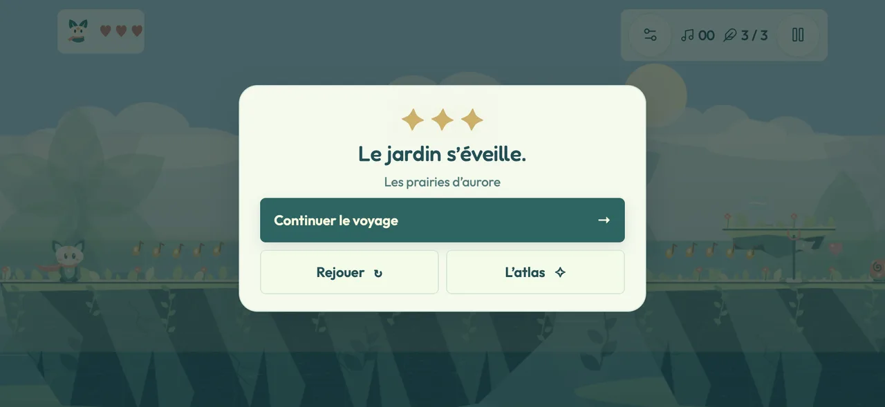

# Itération 10 — Plus de jeu, moins de panneaux

Base : `main` à `79aa01d`, après le retour sur iPhone de l’itération 09.

## Ce qui change

- Le panneau « Cœur comète / Comet heart » et les autres fiches de pouvoir disparaissent. Les pouvoirs et leurs effets sur Lumen fonctionnent toujours.
- Une fin de jardin tient dans une petite carte : fragments, titre, destination suivante, rejouer ou atlas. Les îles montrent les voix retrouvées. Plus de tableau de dégâts, ennemis, score ou objectifs de médaille. Seul le mode chronométré conserve son temps. Les records restent enregistrés.
- Le voile dessiné **par-dessus** le personnage dans les 145 premiers pixels du Chant est supprimé. La caméra accompagne désormais les montées et descentes dans les deux modes, avec une zone centrale stable et une anticipation à la montée. Elle revient au bon cadrage après une chute ou un changement de lieu.
- Une seule palette claire, indépendante du système. Les anciens réglages sombre/système sont normalisés sans perdre les chapitres, fragments, langue ou volumes. iOS utilise également l’apparence claire pour ses contrôles natifs.
- L’introduction reste inchangée. Les 16 autres jardins et les deux dernières îles ont de nouvelles portions jouables. Chaque parcours de campagne reçoit huit terrasses à franchir, un balcon facultatif, des notes, des cœurs et trois lanternes. Les silhouettes varient selon le biome. La colonne se prolonge en hauteur ; le passage final s’insère **avant** l’arène du Gardien. Dans les îles, la troisième voix et le dernier souvenir se trouvent dans le nouvel archipel.

L’atlas, les commandes tactiles, les clés de sauvegarde et le fonctionnement hors ligne restent en place. Les seuils des médailles sont ajustés à la longueur supplémentaire ; les records existants sont conservés.

## Longueur des lieux

Largeurs en unités du monde, pas des durées promises. La colonne conserve sa montée de 2 100 unités et gagne une promenade dans la canopée.

| Lieu | Avant | Après |
| --- | ---: | ---: |
| Prairies d’aurore | 3 900 | 3 900 |
| Cathédrale des racines | 4 320 | 8 180 |
| Sur le dos d’un songe | 3 100 | 6 960 |
| Petit astre égaré | 3 100 | 6 960 |
| Lagon des lucioles | 4 400 | 8 260 |
| Archipels du zéphyr | 4 700 | 8 560 |
| Forge des pétales | 4 600 | 8 460 |
| Pont des veilleurs | 3 000 | 6 860 |
| Rivière sans lune | 4 000 | 7 860 |
| Palais du givre | 4 580 | 8 440 |
| Jardin des heures bleues | 4 200 | 8 060 |
| Vergers du vent | 5 760 | 9 620 |
| Galerie des échos | 6 000 | 9 860 |
| Verger qui rêve | 4 500 | 8 360 |
| Colonne des saisons | 2 000 | 4 750 |
| Là où pleut la lumière | 3 150 | 7 010 |
| Cœur de l’éclipse | 4 800 | 8 740 |
| Île des petits matins | 4 200 | 4 200 |
| Récifs du ciel | 4 700 | 8 900 |
| Grand chœur | 5 100 | 9 300 |

## Vérifications

- `npm run verify` : suites de logique, sauvegarde, poids, densité, audio, langues, moteur, rendu et parcours ; 30 tests navigateur, 6 tests atlas et 15 tests mobile sous Chromium.
- `npm run test:browser:webkit` : les mêmes 51 tests navigateur sous WebKit, édition portable en `file://`, aucune requête externe.
- `npm run test:places` : les six lieux spéciaux terminés depuis leur apparition initiale, par des entrées de déplacement, saut et appel.
- `tests/test-continuations.cjs`, intégré à `npm test` : les 16 portions supplémentaires franchies avec la vraie physique, sans pouvoir ni invulnérabilité injectés. Seule la position initiale sur la première terrasse est une fixture. Caméra contrôlée à 30, 60 et 120 Hz.
- Les îles sont parcourues entièrement par le pilote d’entrées, voix et fragments compris. Les tests mobile vérifient aussi un parcours complet avec suivi vertical, les fins sans défilement, les boutons de 48 px et les safe areas sur six formats, en français et en arabe.
- `npm run ios:sync`, puis compilation Xcode Debug pour iOS avec `CODE_SIGNING_ALLOWED=NO` : vérification de compilation, sans distribution Apple.

Les tests de déplacement prouvent la franchissabilité, pas le plaisir ni la durée d’une première partie humaine. La fluidité et le confort de la caméra restent à confirmer sur l’iPhone physique.

## Aperçus WebKit

Les captures utilisent un format iPhone de 956 × 440, avec safe areas simulées. Le personnage est initialisé sur une plateforme haute pour le contrôle visuel ; la fin est une fixture d’affichage. La dernière capture montre aussi le mode chronométré sur 568 × 320.

## Retester sur l’iPhone

Le dossier iOS local a été synchronisé. Dans Xcode, garder **LUMEN → iPhone de Omar**, puis **⌘R**. Installer par-dessus l’app existante pour garder les sauvegardes.

1. Prendre le pouvoir comète : aucun panneau ne recouvre les flèches.
2. Monter sur les plateformes hautes des Récifs du ciel, sauter et redescendre : Lumen reste lisible et la caméra accompagne le trajet.
3. Terminer un jardin : continuer est visible immédiatement, sans défilement.
4. Passer l’iPhone en mode sombre : les couleurs du jeu restent claires.
5. Rejouer un jardin après les Prairies : poursuivre au-delà de l’ancienne sortie, essayer le balcon facultatif et repartir d’une nouvelle lanterne après une chute.

Sur un autre checkout, exécuter `git pull --ff-only`, `npm ci`, puis `npm run ios:sync` avant d’ouvrir Xcode. Aucun changement de signature personnelle ni de compte Apple n’est inclus dans cette itération.
