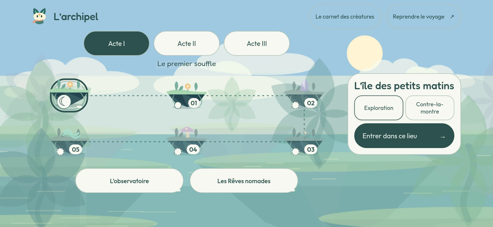
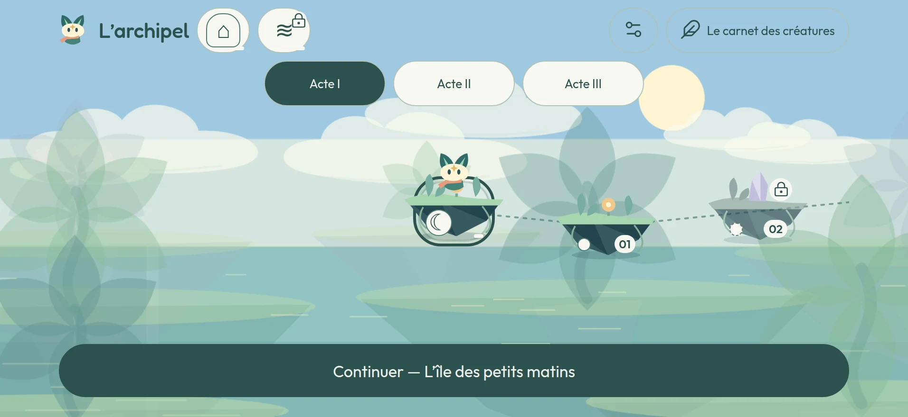
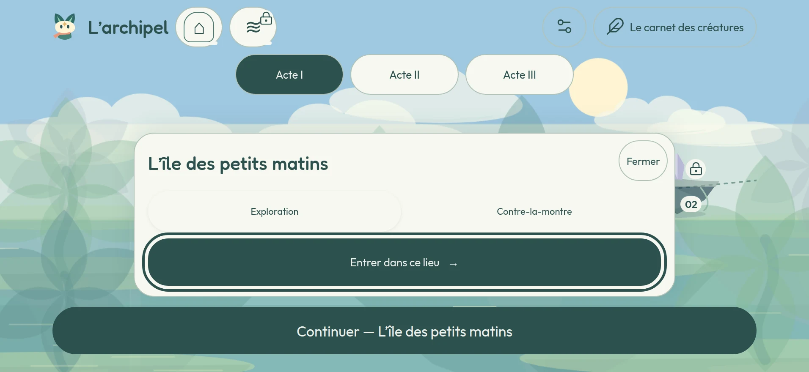
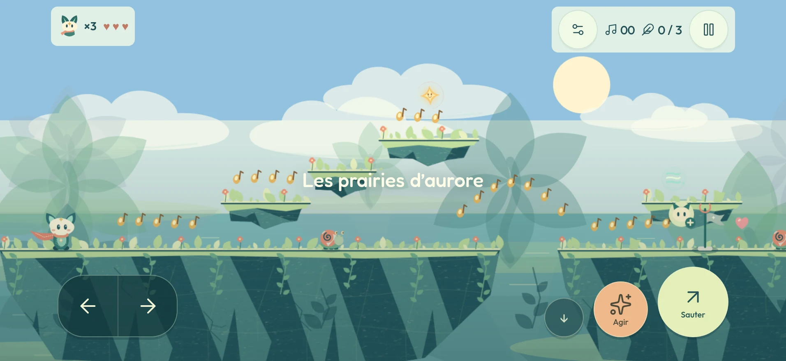
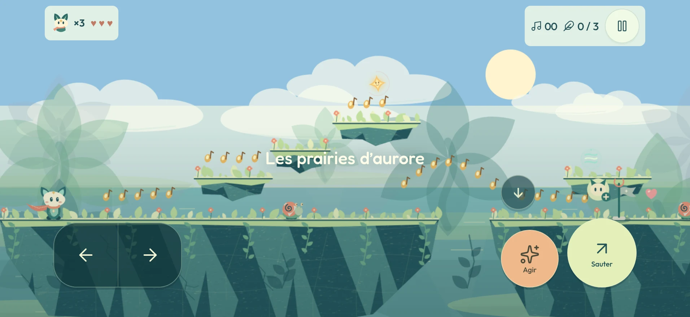
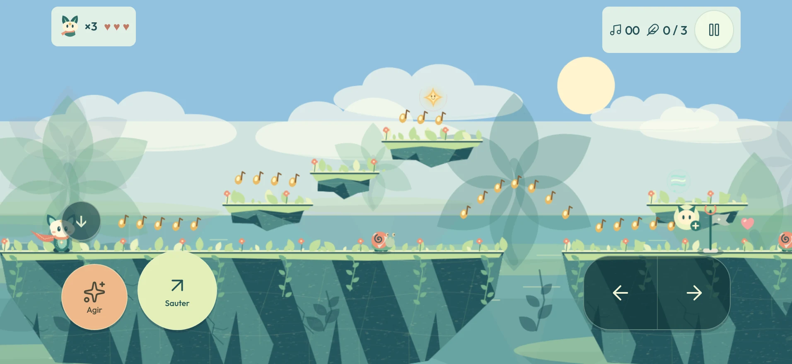
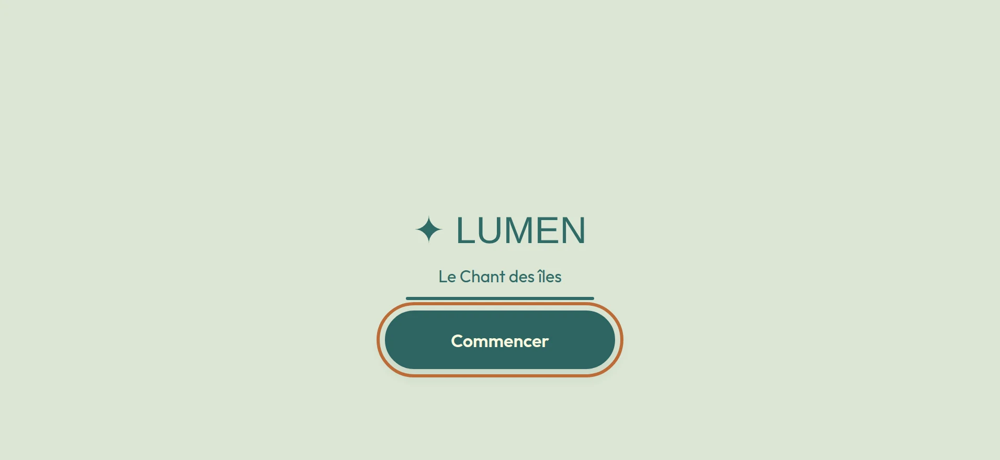
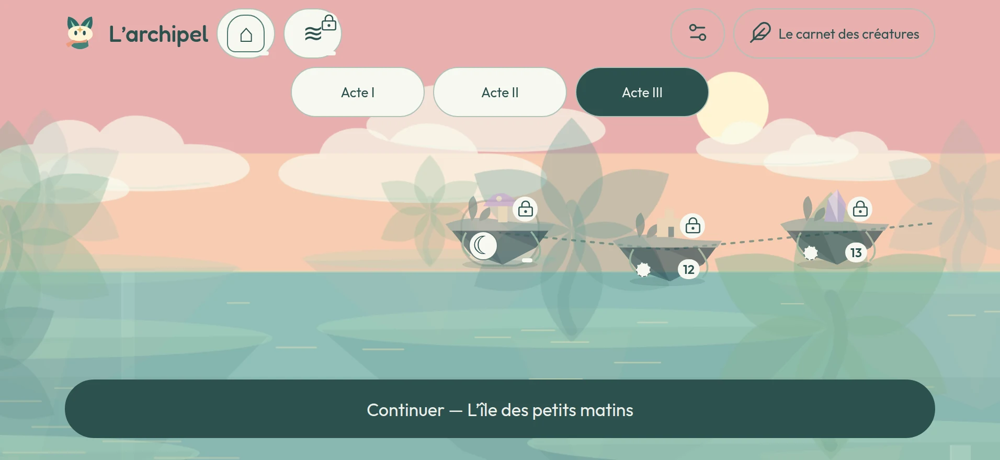
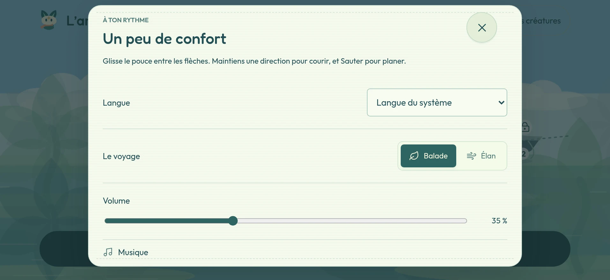

# Itération 11 — Le premier contact

Base : `bb419c7`. Déclencheur : le premier retour extérieur, un collègue d'Omar,
sur la version iOS. Verdict : « pas intuitif, presque pas jouable ».

Ce n'était pas un avis sur le jeu. C'était un avis sur les quatre-vingt-dix
premières secondes — celles qui décident si quelqu'un reste.

Le rapport de l'itération précédente reste dans [Vies et rivière](vies-et-riviere.md).

---

## Jalon 0 — Savoir quelle règle s'appliquait

Deux jeux de règles se disputaient la géométrie des commandes tactiles :
`style.css` (`max(48px, 62px * var(--touch-scale))`, conteneur à
`left:20px; right:20px`) et `play.css` (72 × 74 pour les directions, 86 pour le
saut, conteneur calé sur les safe areas). Les secondes ne s'appliquent que si
`js/touch.js` a posé la classe `lumen-touch` sur `<html>`.

**Mesure, avant toute modification.** Viewport 956 × 440, tactile, marges
natives simulées à 62 px sur les côtés et 21 px en bas.

| Mode | `lumen-touch` | Directions | Action | Saut | Conteneur | Feuille effective |
| --- | --- | --- | --- | --- | --- | --- |
| Jardin (campagne) | **présente** | 72 × 74 | 66 × 68 | 86 × 86 | 70 px des côtés, 29 px du bas | `play.css` |
| Île (Chant) | **présente** | 72 × 74 | 66 × 68 | 86 × 86 | 70 px des côtés, 29 px du bas | `play.css` |

**Le résultat contredit l'hypothèse de départ.** `lumen-touch` était bien posée
dans les deux modes ; ce n'était donc pas une classe manquante qui faisait
retomber l'iPhone sur les 62 px de `style.css`. Les commandes mesuraient
réellement 72 px, collées à 29 px du bas et à 70 px du bord. Le collègue n'avait
pas tort pour autant : 72 px sous un pouce, dans l'angle, c'est petit — c'était
la valeur elle-même, pas un bug de cascade.

La duplication a quand même été supprimée : la géométrie et l'apparence des
commandes vivent maintenant dans `play.css`, une seule fois, indépendamment de
la détection tactile. `style.css` ne décide plus que de ce qui n'est pas la
taille. La visibilité reste décidée par le mode et le périphérique.

> **Réserve.** Ces mesures viennent d'un navigateur, pas de l'iPhone du collègue.
> Aucun appareil physique n'a pu être interrogé pendant cette itération. Elles
> prouvent la règle appliquée, pas le ressenti du pouce.

---

## Les six retours, avant et après

### 1. « Pas intuitif, presque pas jouable » · « la navigation est dure »

**Avant** — l'atlas était une carte qu'il fallait manipuler. Le chemin se lisait
à l'envers : rangée du haut 01 → 02 de gauche à droite, rangée du bas 03 → 04 →
05 de droite à gauche. L'œil lit de gauche à droite et voyait donc « 05, 04,
03 ». Rien ne disait où l'on en était. Lancer un lieu demandait deux gestes :
toucher l'île, puis viser le bouton dans la fiche, à droite, loin du pouce.

**Après** — l'atlas est un menu déguisé en carte. Un quai fixe en bas,
**« Continuer — &lt;lieu&gt; »**, pleine largeur, 56 px de haut, branché sur
`LumenJourney.next()` : aucune sélection, aucun défilement, aucune visée.
Ouvrir l'app et jouer tient en **deux appuis** — le titre, puis Continuer.
Le chemin progresse toujours vers la droite, la carte défile horizontalement et
s'ouvre **cadrée sur le lieu courant**.

Un appui ouvre la fiche, qui monte **du bas**, sous le pouce ; un second appui
sur le même lieu lance. La fiche ne recouvre jamais le quai.

### 2. « Très petits et centrés, je veux plus grand et décalé à gauche »

**Avant** — directions 72 × 74, saut 86, action 66 × 68, pavé collé à 29 px du
bas et 70 px du bord.

**Après**, mesuré dans les deux modes :

| | Avant | Après |
| --- | --- | --- |
| Directions | 72 × 74 | **88 × 88** |
| Saut | 86 × 86 | **96 × 96** |
| Action | 66 × 68 | **80 × 80** |
| Depuis le bord | safe area + 8 px (70) | safe area + 12 px (**74**) |
| Depuis le bas | safe area + 8 px (29) | safe area + 20 px (**41**) |

Les trois crans du réglage valent 85 %, 100 %, 130 % ; le cran par défaut est
désormais 88 px. Plancher absolu 48 px quel que soit le réglage. Une **zone de
contact invisible de 4 px** entoure chaque bouton : un doigt qui manque le
cercle déclenche quand même l'action. La glissade passe au-dessus des actions
pour garder l'espace entre les pouces. Le mode gaucher reflète le pavé sans
inverser les directions physiques. Ni le coyote time de 160 ms ni la
mémorisation de saut de 190 ms n'ont été touchés.

### 3. « Au démarrage il faut donner l'impression que c'est un jeu »

**Avant** — rien. Ni splash natif, ni écran de titre : l'app ouvrait directement
sur du contenu.

**Après** — trois étages. Le launch screen natif (fond sauge, marque centrée)
se fond dans un **écran de titre LUMEN** au même centre, avec une barre de
progression **réelle** : quatre opérations réellement terminées — sauvegarde lue
(miroir natif compris), polices, préparation audio, atlas construit. Un seul
bouton : **« Continuer »**, ou **« Commencer »** à la toute première ouverture.

Ce bouton n'est pas décoratif. C'est **le geste utilisateur qui déverrouille
l'audio iOS**, explicitement et de façon fiable, au lieu de dépendre d'un
`pointerdown` quelconque. Un commentaire le dit dans `js/boot.js` ; ne le
remplacez pas par un délai automatique.

L'écran tient **au moins 1,2 s** même si tout est prêt avant, puis mène à
l'atlas. Jamais à un jardin.

### 4. « On peut imaginer le mascot Lumen en train de marcher d'une étape à une autre »

**Avant** — six îles, aucune marquée. Le joueur devait deviner sa progression.

**Après** — Lumen se tient sur le nœud rendu par `Journey.next()`. C'est le
« tu es ici », et ça remplace toute autre signalétique. **Au retour d'un jardin
terminé**, il marche le long du tracé jusqu'au lieu suivant, une fois, en 1,2 s,
puis s'installe. Sous `reducedEffects` — ou `prefers-reduced-motion` — il
apparaît directement à la bonne position. Il ne bloque aucune interaction : on
peut appuyer pendant qu'il marche.

Les trois états se distinguent **sans lire le texte et sans dépendre de la
couleur** : terminé (île allumée, avec sa marque), disponible (l'île respire,
c'est là qu'est Lumen), verrouillé (silhouette éteinte, **cadenas visible sur la
carte** — plus seulement une phrase dans la fiche).

### 5. « Les menus et la config doivent être disponibles sur l'atlas, pas depuis les stages »

**Avant** — la configuration s'ouvrait depuis le HUD d'un jardin et depuis
l'en-tête d'une île. L'atlas n'avait aucun bouton de réglages.

**Après** — un bouton réglages permanent **sur l'atlas**, en haut à droite,
48 px, avec son libellé accessible. Il ouvre **le panneau existant** — langue,
son, apparence, taille des commandes, gaucher, effets réduits, aide tactile.
Le panneau n'a pas été réécrit : il a été déplacé.

Dans un jardin, la pause ne garde plus que l'essentiel : **Reprendre,
Recommencer, Retour à l'atlas, et le son**. Le bouton réglages du HUD et celui
de l'en-tête du Chant ont disparu. Le carnet des créatures reste où il était.

### 6. « On ne peut pas jouer le stage 5 si on n'a pas terminé 1, 2, 3 et 4 de l'acte »

**Avant** — la règle existait (`journey.js` calculait bien `unlocked` avec
« Termine le jardin précédent pour ouvrir ce lieu »), mais **deux portes
dérobées** la contournaient :

- `js/engine.js` — `isUnlocked()` contenait une boucle « si un chapitre
  ultérieur est ouvert, celui-ci l'est aussi ». Un seul lieu tardif marqué
  ouvert rouvrait donc **tout** en amont ;
- `js/journey.js:32` — `islandAccess()` avait la même exception pour les îles
  de repos.

**Après** — une seule règle décide : *un jardin requis n'ouvre que lorsque le
jardin requis qui le précède est TERMINÉ.* Les deux boucles ont disparu. Il
reste deux exceptions, nommées et bornées dans le code :

1. **un lieu déjà terminé ne se referme jamais**, même hors séquence ;
2. **la frontière d'une sauvegarde reste valable là où elle suit l'ordre**.

La frontière numérique héritée n'est plus « conservée au cas où » : elle est
**migrée**. `migrateJourneyFrontier()` l'inscrit **une fois** en clés stables —
chaque jardin requis jusqu'à la frontière, chaque île de repos qu'elle a
dépassée — y compris pour les lieux ajoutés depuis l'ancienne version. Elle
n'ajoute que des clés, n'en retire aucune, et **la clé `lumen.gardens.v3` ne
change pas**. Aucune sauvegarde ne perd quoi que ce soit ; un joueur déjà plus
loin ne recule jamais.

Les lieux bonus et les passages secrets gardent leur propre règle : un bonus
n'ouvre pas la campagne, et la campagne n'ouvre pas le bonus.

---

## Comment c'est prouvé

`npm run verify` : **4 suites navigateur et 13 suites Node, toutes vertes**.

**`tests/test-order.cjs`** — nouveau, dédié au jalon 5. Sept contrôles : la
route requise parcourue lieu par lieu, acte par acte, en vérifiant qu'aucun
saut n'est possible tant que le précédent n'est pas terminé ; le cinquième lieu
d'un acte fermé tant qu'il manque un seul des précédents ; une île qui attend
tout son acte ; un bonus qui n'ouvre pas la campagne ; une sauvegarde hors
séquence qui garde ce qu'elle avait **sans rien ouvrir au-delà** ; une frontière
héritée migrée une fois puis silencieuse ; et « Continuer » qui ne propose
jamais un lieu fermé.

**`tests/test-mobile.cjs`** — sur **six formats**, en français et en arabe :

- taille rendue, position et `elementFromPoint` de chaque commande, **en jardin
  et en île**, **normal et gaucher**, **aux trois crans de taille** — y compris
  la marge de contact de 4 px, qui est vérifiée, pas supposée ;
- l'enchaînement **titre → atlas**, jamais titre → jardin ;
- « Continuer » **visible sans défilement**, haut d'au moins 56 px, qui lance
  bien le lieu rendu par `Journey.next()` ;
- Lumen **centré sur le lieu courant** à l'ouverture (à 2 px près) ;
- un lieu déverrouillé lancé **en un appui** depuis sa fiche, la fiche ne
  recouvrant jamais le quai, et son bouton réellement atteignable
  (`elementFromPoint`, pas une simple présence dans le DOM) ;
- le bouton réglages présent et atteignable sur l'atlas, marges natives
  comprises ;
- aucun bouton de réglages restant dans le HUD d'un jardin ni dans l'en-tête
  d'une île.

**`tests/test-browser.cjs`** — l'écran de titre tient 1,2 s (mesuré à l'instant
exact où il se déverrouille, pas à l'instant où le test regarde), affiche ses
quatre étapes réelles, déverrouille l'audio au premier appui, dit « Commencer »
sur un profil neuf et « Continuer » sur un profil qui revient, et mène à
l'atlas. Plus les 30 contrôles existants, dont l'absence de tout débordement
horizontal sur cinq formats et en RTL.

**`tests/test-journey-browser.cjs`** — l'atlas s'ouvre sur le lieu **à jouer**,
pas sur celui qu'on vient de quitter ; cibles ≥ 48 px, aucun chevauchement,
états distincts en gris, sur trois formats × deux apparences × deux langues.

### Ce qui n'a pas pu être vérifié ici

- **`npm run test:browser:webkit` n'a pas pu être lancé.** Aucun WebKit n'est
  installable dans l'environnement où cette itération a été faite : le
  téléchargement des navigateurs Playwright y est bloqué par la politique
  réseau. **Toutes les mesures ci-dessus viennent de Chromium.** WebKit est le
  moteur d'iOS : c'est la première chose à relancer sur le Mac.
- Aucun iPhone physique n'a été interrogé. Les marges natives sont simulées.

---

## À revérifier sur l'iPhone, avec le collègue

C'est lui qui valide, pas les tests.

1. **Sur le Mac d'abord** : `npm run test:browser:webkit`. Si un contrôle
   tombe sous WebKit, il tombera aussi sur l'iPhone.
2. `npm run ios:sync`, puis **⌘R** dans Xcode sur **LUMEN → iPhone de Omar**,
   par-dessus l'app existante, **sans la désinstaller** — c'est le seul moyen
   de vérifier qu'une sauvegarde réelle survit à la migration de l'ordre.
3. **Le démarrage** : le launch screen se fond-il dans l'écran de titre sans
   rupture visible ? Le titre dure-t-il assez pour se lire comme intentionnel,
   sans donner l'impression d'attendre ?
4. **Deux appuis pour jouer** : ouvrir l'app, appuyer sur Continuer. Est-ce
   qu'on arrive bien dans le bon lieu, sans rien chercher ?
5. **Les commandes, la vraie question** : 88 px sont-ils assez grands *pour son
   pouce à lui* ? Le pavé est-il assez haut au-dessus du bas ? Lui faire
   essayer les trois crans de taille, et le mode gaucher s'il est gaucher.
   S'il dit encore « trop petit », c'est le cran par défaut qu'il faut monter,
   pas la feuille de style.
6. **L'atlas au pouce** : peut-il changer d'acte, ouvrir une fiche et lancer un
   lieu sans jamais viser ? Le défilement horizontal de la carte gêne-t-il, ou
   se comporte-t-il comme il l'attend ?
7. **Lumen qui marche** : terminer un jardin et revenir à l'atlas. Voit-il le
   déplacement ? Comprend-il que c'est sa progression ?
8. **Les verrous** : essayer d'ouvrir un lieu éloigné. Comprend-il *pourquoi*
   c'est fermé, sans avoir à lire ?
9. **Les réglages** : cherche-t-il encore la configuration depuis un stage, ou
   la trouve-t-il sur l'atlas ?
10. **En paysage, encoche à gauche** : rien ne passe-t-il sous l'encoche ni
    sous l'indicateur d'accueil ?

---

## Ce qui reste ouvert

- **WebKit et l'appareil.** Les deux preuves qui manquent, et les deux seules
  qui comptent vraiment pour une app iOS.
- **Le cran par défaut des commandes.** 88 px est un pari raisonné, pas une
  mesure prise sur un pouce. Le retour du collègue tranchera.
- **La marche de Lumen** est vérifiée comme *positionnement* (il est sur le bon
  nœud à l'ouverture), pas comme *animation* : aucun test ne mesure aujourd'hui
  le trajet ni sa durée.
- **Le milieu de l'atlas reste calme.** Le tiers inférieur est toujours de
  l'eau décorative ; le quai de départ occupe désormais cette zone, mais la
  carte elle-même n'a pas gagné en densité.
- **Les haptiques, Game Center et les achats intégrés** restent hors de cette
  itération, comme prévu.
