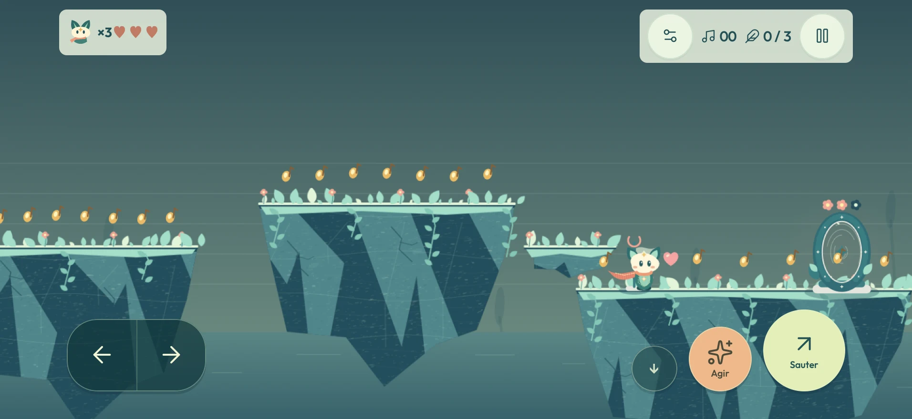
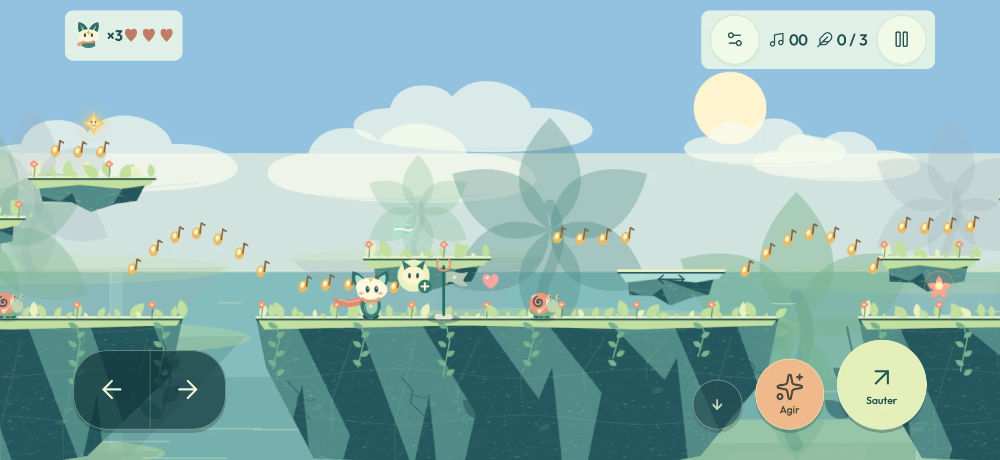
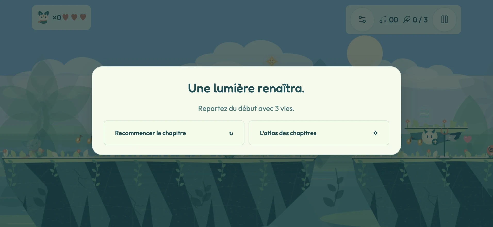

# Itération 11 — Pouvoir revenir, avoir trois chances

Base : `main` à `4bbb6f3`. Retours d'Omar après un parcours sur iPhone 16 Pro Max jusqu'à l'acte II.

## La rivière sans lune

La dernière descente du prolongement mesurait 140 unités, au-delà du saut
normal au retour. Une marche intermédiaire partage cette hauteur en deux
sauts. Le même correctif traite les grandes descentes des autres prolongements,
sans augmenter la puissance du saut ni rendre un pouvoir obligatoire.

Les ponts temporaires avaient aussi leurs carillons du côté aller. Quatre
carillons supplémentaires permettent de les rappeler depuis la rive opposée.
La porte fermée montre trois fleurs, dont celles déjà réveillées : **elle
attend les trois reflets, pas les trois fragments facultatifs**.

## Trois vies dans chaque stage

| Situation | Règle actuelle |
| --- | --- |
| Nouvelle île ou nouveau chapitre | 3 vies, compteur visible près de Lumen |
| Santé à zéro ou chute | Une vie perdue, une seule fois |
| Il reste des vies | Retour au drapeau ; Balade conserve son retour au dernier sol stable |
| Effigie de Lumen avec un + | Une vie supplémentaire, jusqu'à 9 ; deux effigies par stage |
| Déjà 9 vies | L'effigie reste disponible |
| Retour après une mort | Objets déjà pris toujours absents, santé restaurée |
| Zéro vie | Défaite : recommencer le stage depuis le début ou aller à l'atlas |
| Recommencer | 3 nouvelles vies, lanternes et objets du stage réinitialisés |
| Stage suivant | Nouvelle réserve de 3, sans report du stage précédent |

La campagne ne donne plus de vie toutes les quarante notes. Les Rêves nomades
conservent leur réserve de trois vies sur toute une expédition et ce bonus de
notes. Les trois cœurs restent la santé, distincte du nombre de vies.

Les îles avaient jusqu'ici des retours illimités. Elles disposent maintenant
de leur propre écran de défaite, court et traduit, sans bouton de reprise
permettant de contourner l'épuisement. Revenir depuis l'atlas conserve une
tentative perdue ; choisir de relancer le lieu crée une nouvelle tentative.
Aucune migration de sauvegarde : lieux terminés et records sont conservés.

## iOS : mode Jeu et Concentration

Le projet déclare `LSSupportsGameMode = true`, avec `GCSupportsGameMode = true`
pour iOS 18.0–18.5, ainsi que la catégorie `public.app-category.games`.
Le choix effectif d'activer le mode Jeu appartient à iOS et aux réglages de
l'appareil. Il n'a pas été observé sur un iPhone physique pendant cette itération.

**La Concentration est distincte.** L'app ne peut pas imposer la suppression
des notifications des autres apps. Le [guide du jeu](../guide-du-jeu.md#iphone--mode-jeu-et-notifications)
explique le réglage unique : **Réglages → Concentration → Jeu vidéo → Ajouter
un programme → App → LUMEN**, puis les notifications autorisées.

Références Apple consultées :
[LSSupportsGameMode](https://developer.apple.com/documentation/bundleresources/information-property-list/lssupportsgamemode),
[GCSupportsGameMode](https://developer.apple.com/documentation/bundleresources/information-property-list/gcsupportsgamemode),
[catégorie et activation selon Apple DTS](https://developer.apple.com/forums/thread/764575),
[mode Jeu et Gaming Focus](https://support.apple.com/en-nz/105118),
[programmer une Concentration](https://support.apple.com/fr-fr/guide/iphone/iphd6288a67f/ios).

## Documentation

Le [README](../../README.md), le [bilan de conception](../chant-design.md) et
le nouveau [guide du jeu](../guide-du-jeu.md) décrivent l'état actuel : niveaux
prolongés, caméra verticale, palette claire, commandes mobiles, fins compactes,
vies et installation iOS. Les rapports d'itération antérieurs restent historiques.

## Validation

- `npm run verify` : suites Node et navigateur Chromium, dont 30 contrôles généraux, 6 atlas et 15 mobile.
- `npm run test:browser:webkit` : les mêmes 51 contrôles navigateur sous WebKit.
- `npm run test:places` : six lieux spéciaux terminés par les entrées réelles.
- `tests/test-continuations.cjs` : les 16 prolongements parcourus **dans les deux sens**, sans chute ni pouvoir ; physique réelle à partir d'une position initiale de contrôle.
- `tests/test-river-return.cjs` : dernier drapeau → première fleur oubliée → porte ouverte, sans mort ni téléportation après la mise en place initiale. Les ponts sont initialement endormis et les trois fragments ne débloquent pas la porte.
- `tests/test-lives.cjs` : trois modes, consommation unique par mort, zéro vie bloquant, ramassages sans duplication, plafond, santé distincte, reprise à trois vies et progression conservée. Les **40 effigies des 20 stages** sont ramassées avec de vrais sauts depuis le sol adjacent.
- Tests mobile : compteur visible et menu de défaite sans défilement sur six formats, en français et arabe, avec véritable bouton pour recommencer.
- Le test d'écoute mesure désormais plusieurs blocs audio jusqu'à 1,5 seconde, au lieu d'un seul prélèvement après 300 ms. Il exige toujours de vrais échantillons sonores ; l'audio du jeu est inchangé.
- `npm run ios:sync`, puis compilation Xcode Debug iOS avec `CODE_SIGNING_ALLOWED=NO`.

Les captures sont réalisées sous WebKit à 956 × 440, avec safe areas et pont
natif simulés. Elles vérifient l'affichage, pas le matériel. La fluidité,
l'activation du mode Jeu et le filtrage de notifications restent à confirmer
sur l'iPhone. Les budgets de poids et les clés de sauvegarde sont inchangés.

## Retester

Le dossier iOS local est synchronisé. Garder **LUMEN → iPhone de Omar** dans
Xcode et lancer **⌘R**, par-dessus l'app existante, sans la désinstaller.

1. Dans la rivière, laisser volontairement la première grande fleur endormie. Revenir depuis le dernier drapeau, réveiller les ponts depuis la droite, appeler la fleur et repartir à la porte.
2. Commencer un stage : lire `×3`, prendre une effigie `+`, lire `×4`.
3. Perdre une vie : retour au drapeau, effigie toujours absente. Épuiser la réserve : aucune reprise au drapeau possible ; recommencer redonne trois vies au début.
4. Vérifier aussi la défaite sur une île en Balade ou Élan.
5. Configurer la Concentration Jeu vidéo liée à LUMEN, ouvrir le jeu et contrôler son activation.

Sur un autre checkout : `git pull --ff-only`, `npm ci`, `npm run ios:sync`,
puis ouvrir le projet iOS. Les réglages personnels de signature restent locaux.
