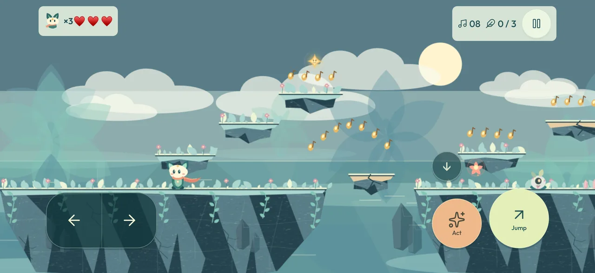
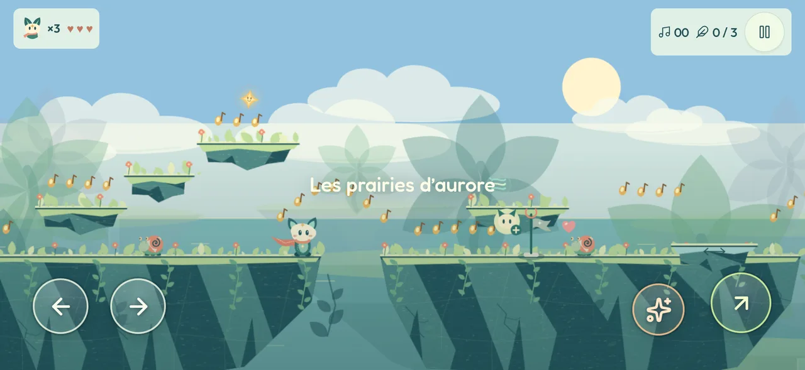
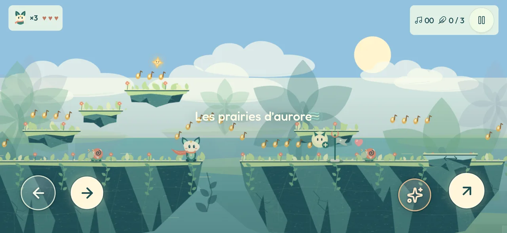
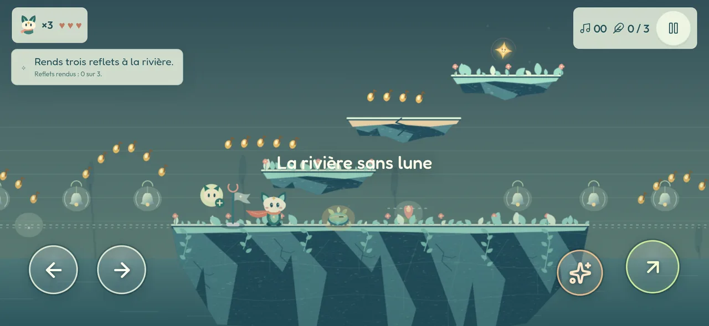
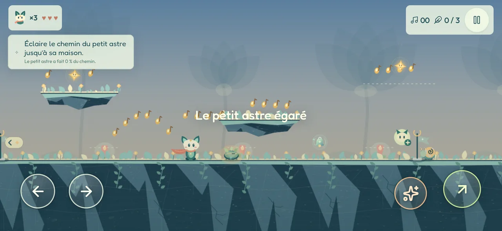

# Itération 12 — Laisser voir le jardin

Base : `07f1e39`. Deux demandes, arrivées ensemble.

La première, d'Omar, sur les commandes tactiles : « moches, elles prennent
beaucoup d'espace, ça cache une partie de l'écran ». La taille cliquable
convenait ; c'est l'encre qui gênait.

La seconde, l'[issue #3](https://github.com/omarRamo/lumen/issues/3) : sur
certains lieux, « j'ai fouillé partout pour collecter tous les objets mais le
portail de sortie reste bloqué […] ce n'est pas intuitif du tout ». Et, en
seconde moitié : « c'est le même stage répété ».

Le rapport précédent reste dans [Le premier contact](../iteration-11/README.md).

---

## 1. Des commandes qui laissent voir le jardin

### Avant

Quatre boutons posés sur le décor, tous opaques : un bandeau sombre plein
largeur sous les deux flèches, deux pastilles pleines à droite, et un cinquième
cercle pour la glissade, flottant au-dessus de l'action.



### Après

La **cible tactile ne bouge pas** — 88 px pour chaque direction, 96 pour le
saut, 80 pour l'action, plus la marge de 4 px ajoutée en itération 11. C'est
l'encre qui recule : le bouton ne dessine plus rien lui-même, et son `::before`
trace un disque de verre plus petit que la zone touchable.

| Commande | Cible tactile | Disque visible |
| --- | --- | --- |
| Gauche / Droite | 88 px | 66 px |
| Saut | 96 px | 72 px |
| Action | 80 px | 62 px |



Le verre tient sur les deux fonds du jeu : un intérieur sombre très dilué pour
rester lisible sur un ciel clair, un liseré clair pour rester lisible sur la
roche, et une ombre portée sur le glyphe. La couleur des deux actions passe
dans le liseré et le glyphe au lieu d'un aplat — le saut reste vert, l'appel
reste orange, sans masquer ce qu'il y a derrière.

L'appui, lui, ne se discute pas : le verre devient crème pleine, le glyphe
passe en sombre, le disque se resserre de 7 %.



Le bandeau des directions disparaît. Deux disques voisins le remplacent ; le
glissement d'un pouce de l'un à l'autre, sans lever le doigt, continue de
fonctionner — il se mesure sur la boîte englobante des deux, pas sur un fond.

Les libellés « Sauter » et « Chanter » quittent l'écran. Ils vivent maintenant
dans le `title` et l'`aria-label`, où ils servent les lecteurs d'écran sans
occuper le jardin.

### Le bouton bas est supprimé

Question posée : « le bouton bas est-il vraiment utile ? »

Vérification faite, il ne l'était pas. `↓` ne sert qu'à la glissade — le
personnage passe de 46 à 29 px de haut en courant. **Aucun couloir du jeu ne
demande de baisser la tête** : les corniches sont à plus de 80 px du sol
partout, et la glissade n'ouvre donc aucun passage. Elle était déjà masquée
dans les îles du Chant. Elle coûtait un cinquième cercle en travers du décor.

Le clavier (`↓`, `S`) et la manette la gardent entière. Un test verrouille la
décision : les commandes tactiles sont exactement `left`, `right`, `jump`,
`action`.

---

## 2. Issue #3, première moitié — savoir ce que la porte attend

### Ce qui se passait vraiment

Deux lieux ferment leur portail jusqu'à ce qu'une condition soit remplie :

- **Le petit astre égaré** — la sortie s'ouvre quand l'astre atteint sa maison.
- **La rivière sans lune** — la sortie s'ouvre quand les trois grandes corolles
  sont réveillées.

Ce n'était pas un bug : c'était la règle du lieu. Mais **rien ne la disait**. On
pouvait ramasser chaque note d'un bout à l'autre du niveau, revenir devant un
portail muet, et en conclure à une panne. Le portail fermé se dessinait déjà
un peu plus gris — c'est tout ce qu'il avait à offrir.

Sur iPhone, c'était pire. `js/ui.js` coupait les aides de niveau pour **tous**
les écrans tactiles :

```js
const hint = !window.LumenTouch?.enabled && … ? (game.level.hints || []).find(…) : null;
```

La phrase « Trois grandes corolles gardent les reflets perdus » ne s'affichait
donc jamais sur l'appareil où l'issue a été écrite.

### Trois réponses, aucune qui donne le chemin

**Le lieu annonce sa condition tout du long.** `LumenPlaces.objective()` rend
la phrase du niveau et son décompte ; le bandeau de quête — déjà présent pour
la coupole de l'observatoire — les affiche en permanence, et bascule sur
« La sortie s'ouvre. » quand c'est fait.



**Un portail fermé répond.** Arriver dessus rappelle l'objectif du niveau, une
fois toutes les cinq secondes. Le silence se lisait comme une panne.

**Ce qui manque est désigné quand il sort de l'écran.** Une petite balise au
bord pointe vers la corolle éteinte la plus proche, ou vers l'astre qui attend
dans le noir. Elle donne une **direction, jamais un tracé** : le trajet, les
sauts et les détours restent entiers, et elle disparaît dès que la chose est
visible. Dans un lieu sans condition, elle n'existe pas.



### Les aides atteignent enfin le pouce

Elles passent en bulle plutôt qu'en bandeau — elles disent la même chose, puis
s'effacent au lieu d'occuper le bas de l'écran, une seule fois par visite.

Sauf celles qui nomment une touche du clavier : elles n'ont rien à apprendre à
un pouce. Le tri se fait sur la phrase écrite en français, pas sur sa
traduction — le verdict reste donc le même dans les cinq langues.

Trois aides des lieux disaient « appelle avec X ». Elles sont réécrites sans
nommer de touche, et retraduites :

| Avant | Après |
| --- | --- |
| Réveille les fleurs **avec X**. Le petit astre… | **Ton appel ouvre les fleurs.** Le petit astre… |
| Monte sur son dos, puis **appelle avec X**. | Monte sur son dos, puis **appelle-le**. |
| **Appelle avec X** : le nuage vient pleuvoir… | **Ton appel fait venir le nuage** pleuvoir… |

---

## 3. Issue #3, seconde moitié — ce qui a été fait, et ce qui ne l'a pas été

« Créativité très nulle, c'est le même stage répété, il faut changer de voyage,
de thème et d'épreuve. »

**Ce qui a été corrigé.** Deux des six lieux — *Le petit astre égaré* et
*Là où pleut la lumière* — partageaient la palette `secret`, celle du jardin
oublié et de l'observatoire. Chacun a désormais son ciel :

- `dusk` pour l'astre : un crépuscule bleu qui descend vers l'or, pour que la
  petite lumière soit enfin la chose la plus claire de l'écran.
- `rain` pour la pluie : une averse verte et dorée.

Les six lieux ont maintenant six palettes distinctes. Les vignettes de
`docs/platforms/` sont régénérées, en jour et en nuit, et passent les mêmes
contrôles de contraste que les autres.

**Ce qui n'a pas été fait, et pourquoi.** Le reste du retour n'est pas un bug,
c'est une direction de conception, et je ne voulais pas réécrire la géométrie
des niveaux sur une supposition. Le constat, lui, est juste : les six lieux
proposent bien six idées différentes — porter, escorter, enchaîner, rallumer,
monter, faire pousser — mais **quatre d'entre elles se jouent avec le même
verbe**, appeler au bon endroit au bon moment, sur une bande de sol plat
parcourue de gauche à droite. C'est là que naît la sensation de répétition, et
c'est structurel, pas cosmétique.

Trois pistes, à trancher avant d'écrire quoi que ce soit :

1. **Varier le verbe.** Un lieu qui ne se résout pas par un appel — du
   placement, du rythme, ou une contrainte de trajet.
2. **Varier la silhouette.** Rompre le sol continu : archipel, descente,
   aller-retour. La colonne des saisons le fait déjà ; elle est aussi celle
   qu'on distingue le mieux des autres.
3. **Varier l'épreuve dans le temps.** Un lieu qui change d'état à mi-parcours
   plutôt qu'un seul mécanisme tenu de bout en bout.

---

## Ce qui a été vérifié

| Suite | Résultat |
| --- | --- |
| `npm test` (17 suites Node) | vert |
| `tests/test-browser.cjs` | 32 / 32 |
| `tests/test-journey-browser.cjs` | 6 / 6 |
| `tests/test-mobile.cjs` | 15 / 15, six formats × deux langues |

Nouveaux contrôles :

- trois contrats de lieu gardé : la condition annoncée, le décompte qui suit,
  la balise qui désigne puis disparaît, le rappel du portail fermé qui ne se
  répète pas à chaque image ;
- un contrôle navigateur qui suit la rivière, en tactile, du bandeau vide
  jusqu'à la sortie ouverte, et qui vérifie qu'une aide sans touche arrive en
  bulle pendant que le bandeau du clavier reste caché ;
- un contrôle de traduction sur ce qu'un lieu gardé dit de sa porte ;
- l'encre des commandes tactiles, mesurée plus petite que leur cible aux trois
  tailles de réglage.

> **Réserve, inchangée depuis l'itération 11.** Tout vient de Chromium. WebKit
> n'a pas pu être installé dans cette session (réseau restreint), et aucun
> appareil physique n'a été interrogé. Ces contrôles prouvent des règles
> appliquées, pas le ressenti du pouce sur l'iPhone.
