# Itération 13 — Cinq lieux qui ne se ressemblent plus

Base : `a9198ef`. Une seule demande, la seconde moitié de
l'[issue #3](https://github.com/omarRamo/lumen/issues/3) : « créativité très
nulle, c'est le même stage répété, il faut changer de voyage, de thème et
d'épreuve ».

Le rapport précédent reste dans [Laisser voir le jardin](../iteration-12/README.md).

---

## Le constat, relu avant d'écrire

L'itération 12 disait « quatre lieux sur six se jouent avec le même verbe ».
En relisant les six lieux, c'était en fait **cinq** : le songe, l'astre, les
veilleurs, la rivière et la pluie démarraient tous par un appel de Résonance.
Le pilote automatique le disait sans détour, puisqu'il appuyait sur Action en
continu dans tous les lieux. Côté forme, `astre-a-guider` était un seul sol
plat de 3100 px, et le songe, le pont et la pluie des bandes à y = 600. Seule
la colonne des saisons se distinguait.

Trois axes ont été proposés — varier le verbe, la silhouette, l'épreuve dans
le temps. **Choix d'Omar : les trois axes, sur cinq lieux.** La colonne, qui
se distinguait déjà, n'a pas été touchée.

### Les silhouettes, avant et après

Chaque bande est le profil de la partie propre d'un lieu (avant la suite
commune), à la même échelle, dessiné depuis `LUMEN_LEVELS`. Le point bleu
marque le départ. Toutes les images de ce rapport sont produites par
`node work/lieux-captures.cjs avant|apres` ; les scènes posent le joueur à
un endroit choisi pour l'illustration, ce ne sont pas des preuves.

| Avant | Après |
| --- | --- |
| 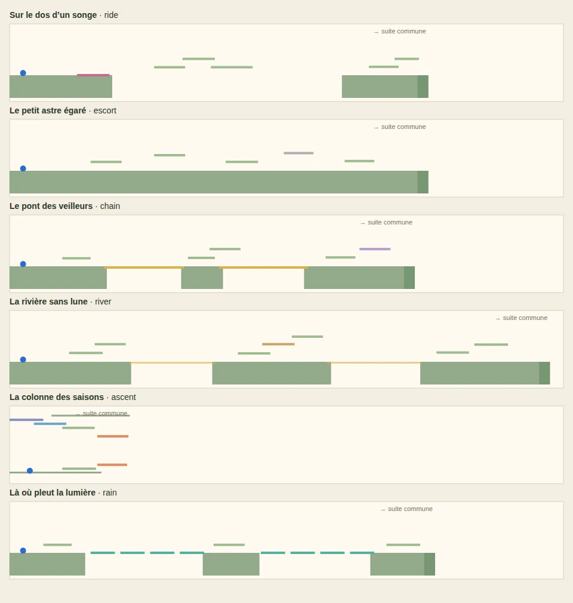 | 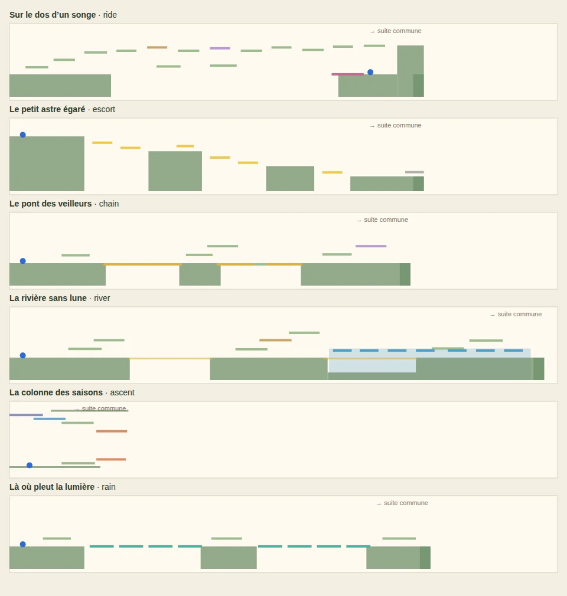 |

---

## 1. Là où pleut la lumière — le rythme remplace la voix

*Axe : le verbe.*

**Avant.** L'appel faisait venir le nuage là où l'on regardait. Le lieu
revenait à appuyer sur le bouton de la voix, puis à attendre.

**Après.** Le nuage ne répond plus à rien. Chaque vide a le sien, qui fait
toujours la même ronde : il se forme au-dessus de la rive, traverse dans le
sens du voyage, fait pousser les pas un par un, se défait sur l'autre rive,
puis repart du début. Une fois la pluie passée, un pas vit 3,5 s : les pas
s'effacent derrière elle. On lit le nuage, on part juste derrière lui, sans
le doubler ni traîner. Qui arrive trop tard attend le passage suivant, moins
de dix secondes plus tard.

La position du nuage ne dépend que du temps : une chute ne la dérègle pas, un
appel ne la déplace pas. La petite voile du nuage montre le sens de la ronde.

| Avant | Après |
| --- | --- |
| 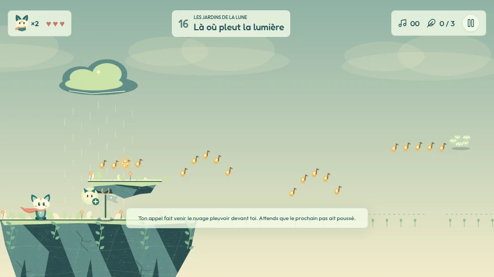 | 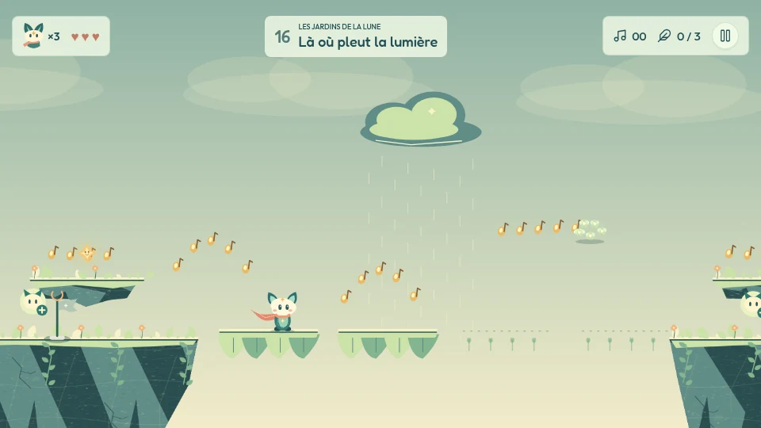 |

**Risque de régression.** Faible : tout se passe dans la branche `rain` de
`places.js` et dans le dessin du nuage. Le contrat du lieu n'a pas changé.

---

## 2. Le petit astre égaré — on le porte, et le lieu descend

*Axes : le verbe et la silhouette.*

**Avant.** On appelait des fleurs, et l'astre avançait seul dans leur
lumière, sur un sol plat.

**Après.** On le **porte**. Le même geste le prend et le pose. Porté, il
éclaire autour de lui, et sa lumière fait exister les passerelles — elles
n'existent que dans cette lumière. Mais il pèse : le saut passe d'environ
125 px à environ 85 px, et la marche ralentit un peu. Posé, il reste où on
l'a laissé et continue d'éclairer.

C'est ce qui crée un vrai **placement**. Une corniche de lumière, 110 px
au-dessus de la première terrasse, est hors de portée d'un saut chargé. Il
faut poser l'astre à son pied, puis sauter les mains libres. Elle mène à un
éclat et au passage secret. Un autre éclat, sur la deuxième terrasse,
fonctionne sur la même idée.

La silhouette change aussi : on part d'un plateau en haut à gauche, et le
vallon est 700 px plus bas, à droite. Entre les deux, quatre terrasses et six
passerelles de lumière. Le lieu fait maintenant 1300 px de haut, et la suite
commune reprend à la hauteur du vallon.

Une chute ne sépare jamais le joueur de l'astre : il revient avec lui à la
lanterne. Sans cette règle, un astre posé au bord d'un vide pourrait devenir
impossible à récupérer.

| Avant | Après |
| --- | --- |
| 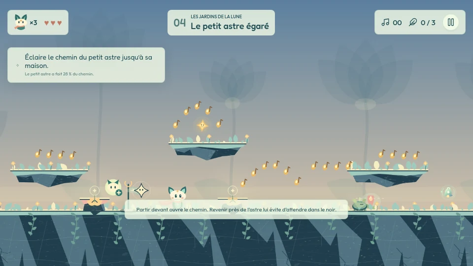 | 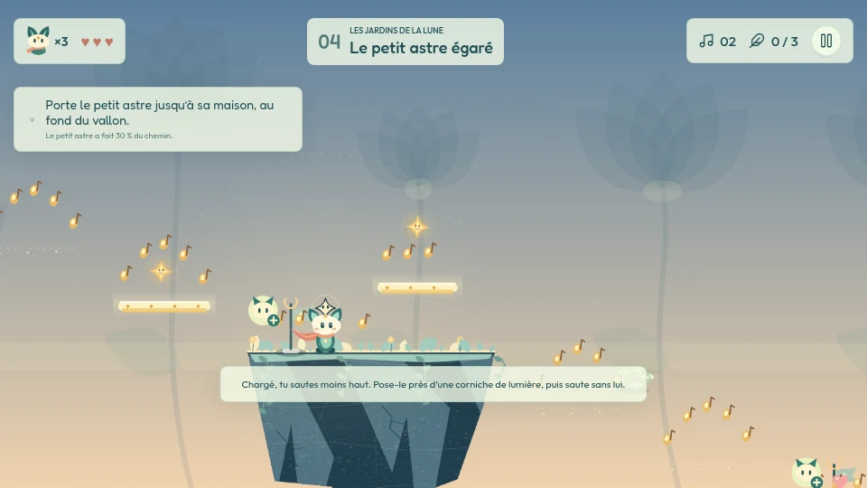 |

**Risque de régression.** C'est le changement le plus profond de
l'itération :

- `engine.js` gagne un état `player.burden`, qui raccourcit le saut et
  ralentit un peu la marche. Il vaut `false` partout ailleurs, et aucun autre
  lieu ne le touche.
- `levels.js` accepte qu'un lieu fixe la hauteur où reprend la suite commune
  (`place.shore`), et donne aux sols de la suite la hauteur du lieu. Pour les
  lieux de 900 px de haut, rien ne change.
- Un petit détour d'écho a été ajouté après la maison : le premier acte devait
  garder trois lieux à écho, et `test-engine` le vérifie.

---

## 3. Sur le dos d'un songe — un aller-retour

*Axe : la silhouette.*

**Avant.** On montait sur le dormeur, qui allait de gauche à droite, vers la
sortie.

**Après.** On part de l'île de droite, adossée à une falaise de 350 px
qu'aucun saut ne franchit. Le dormeur emmène vers la **gauche**, loin de la
sortie, au-dessus du gouffre. De l'autre côté, un escalier mène à la route
des hauteurs, et c'est par là qu'on revient : trois marches, puis neuf
corniches (dont une friable et une qui s'efface) au-dessus du chemin de
l'aller, jusqu'au sommet de la falaise. De là, on redescend dans la suite
commune.

| Avant | Après |
| --- | --- |
| 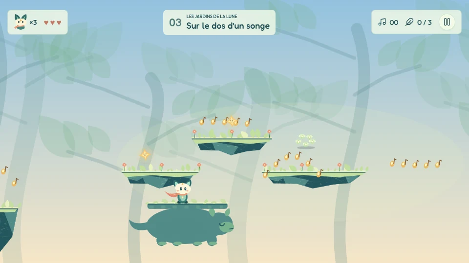 | 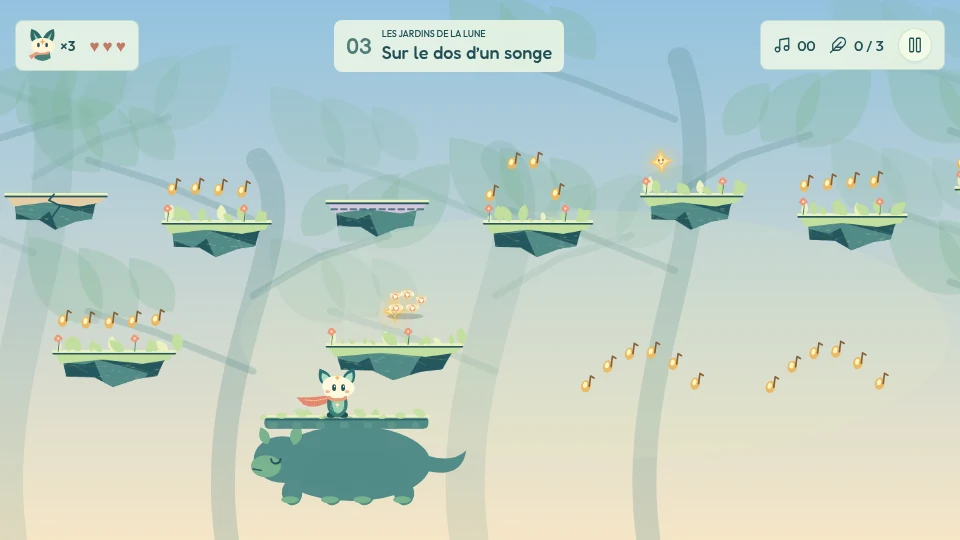 |

**Risque de régression.** Moyen. Le dormeur peut maintenant partir de
l'autre bout (`startAt: 'to'`), et le pilote sait attendre un trajet vers la
gauche. Un nouveau contrôle prouve que l'île de départ est fermée : six
secondes de course et de sauts contre la falaise ne la franchissent pas.

---

## 4. La rivière sans lune — la crue

*Axe : l'épreuve dans le temps.*

**Avant.** Un seul mécanisme de bout en bout : appeler, relayer, allumer
trois reflets.

**Après.** Au **deuxième reflet** rendu, la rivière se souvient et
**déborde**. L'eau monte à sa vitesse, sur la dernière rive et le gouffre qui
la précède. En bas, la marche devient une nage lente. Sept nénuphars montent
avec l'eau et forment une route plus rapide, mais deux d'entre eux
s'enfoncent sous le poids. Le gouffre a désormais un fond où l'on nage, au
lieu d'un vide où l'on tombe. Une fois montée, l'eau ne redescend pas, même
après une chute.

| Avant | Après |
| --- | --- |
| 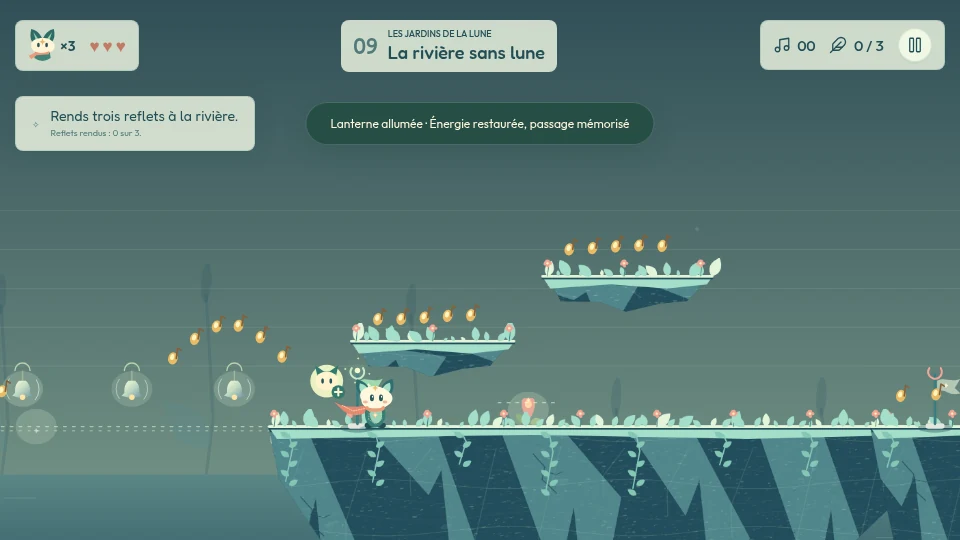 | 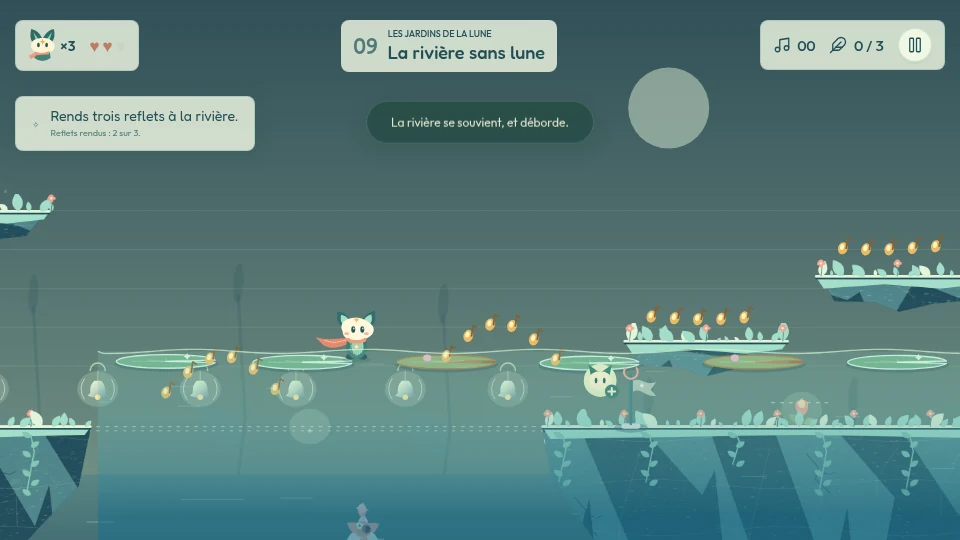 |

**Risque de régression.** Moyen. La rivière avait son propre contrôle de
retour (`test-river-return` : repartir de la dernière lanterne vers la source
oubliée). Il passe tel quel, crue comprise, sans mort. Le lit du gouffre et
les nénuphars restent inactifs avant la crue, même après une chute, pour que
rien n'apparaisse avant son heure.

---

## 5. Le pont des veilleurs — la nuit use le chant

*Axe : l'épreuve dans le temps.*

**Avant.** Une voix réveillait toute la chaîne, et le pont tenait tant que
tous chantaient.

**Après.** Quatre veilleurs, et le lieu change à mi-chemin. Tant qu'on n'a
pas dépassé la première travée, une seule voix réveille toute la chaîne.
Dès qu'on pose le pied au-delà, **la nuit tombe** : le chant faiblit et, à
partir de là, chaque veilleur ne réveille plus que ses voisins. Chaque
tablier ne tient que si les deux veilleurs qui le bordent chantent. La
seconde travée se passe donc en deux fois : on s'arrête sur la pile du
milieu, où veille le troisième, pour appeler le quatrième.

| Avant | Après |
| --- | --- |
| 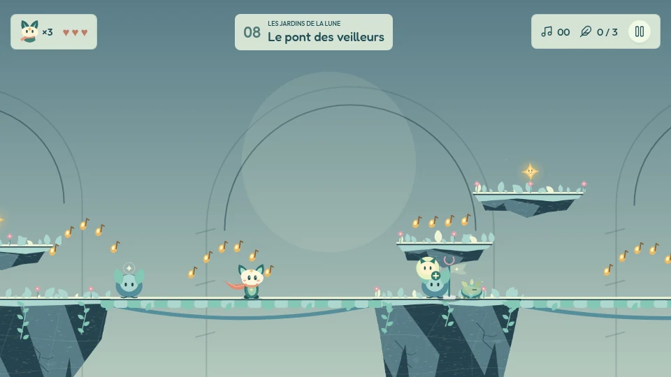 | 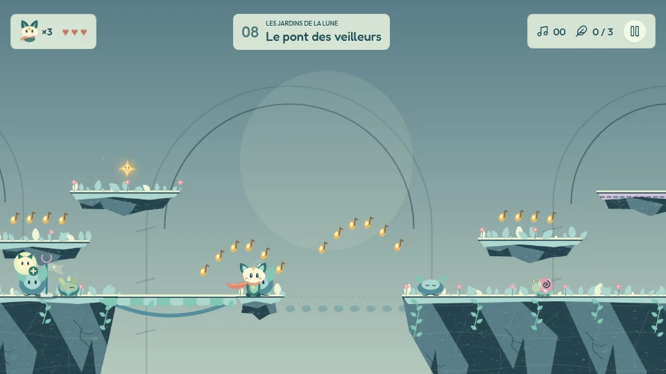 |

**Risque de régression.** Faible : la règle « chaque tablier tient par ses
deux voisins » ne s'applique qu'aux tabliers qui déclarent `between`.

---

## Ce qui a été vérifié

Un jalon, un commit, et `npm run verify` vert avant chacun : build, les 17
suites Node, puis les suites navigateur Chromium.

| Suite | Résultat |
| --- | --- |
| `npm test` (17 suites Node) | vert |
| `tests/test-places.cjs` | 17 / 17 |
| `tests/test-places-playthrough.cjs` | 6 / 6 lieux finis, 0 mort |
| `tests/test-browser.cjs` | 32 / 32 |
| `tests/test-journey-browser.cjs` | 6 / 6 |
| `tests/test-mobile.cjs` | 15 / 15 |
| `npm run test:weight` | 4 / 4 — images suivies 5,8 Mo sur 6,0 Mo |

**Le pilote finit chaque lieu avec de vraies entrées**, sans téléportation ni
invulnérabilité injectée :

| Lieu | Temps | Morts | Ce que le contrat exige, et ce qui a été mesuré |
| --- | --- | --- | --- |
| Sur le dos d'un songe | 43,4 s | 0 | porté ≥ 800 px **et** retour par les hauteurs : 1529 px, oui |
| Le petit astre égaré | 23,4 s | 0 | porté ≥ 2400 px, ≥ 4 passerelles, rentré : 3890 px, 5, oui |
| Le pont des veilleurs | 21,9 s | 0 | ≥ 3 réveils, ≥ 300 px de pont, **la nuit tombée, ≥ 1 réveil de nuit** : 5, 504 px, oui, 1 |
| La rivière sans lune | 29,8 s | 0 | 3 reflets, **crue, ≥ 2 nénuphars** : 3, oui, 5 |
| La colonne des saisons | 27,5 s | 0 | inchangé |
| Là où pleut la lumière | 38,4 s | 0 | ≥ 3 pas poussés, ≥ 2 atterrissages : 32, 8 |

Les contrats des quatre lieux dont le mécanisme a changé ont été **durcis,
jamais assouplis** : chacun exige en plus que la nouvelle idée ait été jouée.
Celui de l'astre a changé de nature, puisque son verbe a changé : on n'y
compte plus des fleurs réveillées, mais la distance portée et les passerelles
foulées.

Le pilote lit l'état visible d'un lieu, comme un joueur. Il attend que le
nuage se forme et ne saute pas sur un pas qui tremble. Il n'appuie sur Action
que pour prendre l'astre. Il attend que le dormeur arrive au bout de l'aller.

Nouveaux contrôles dans `tests/test-places.cjs` :

- la pluie : un appel ne déplace pas le nuage ; la traversée va toujours dans
  le sens du voyage ; les pas poussent dans l'ordre, s'effacent, puis
  repoussent au passage suivant ;
- l'astre : il ne répond pas à l'appel ; les passerelles n'existent qu'à sa
  portée ; un saut chargé rate la corniche, et une fois l'astre posé à côté,
  on l'atteint et on trouve le passage secret ; partir seul est une chute, et
  la chute ramène l'astre ;
- le songe : l'aller part vers la gauche, et l'île de départ reste fermée ;
- la rivière : un reflet ne suffit pas, le deuxième fait déborder la rivière ;
  l'eau monte peu à peu ; on nage sur la rive basse ; le gouffre a un fond ;
  un nénuphar friable s'enfonce ; la crue survit à une chute ;
- le pont : avant la nuit, une voix réveille les quatre veilleurs ; après,
  la voix ne va plus qu'aux voisins, la seconde travée reste noire depuis
  l'île et se forme depuis la pile ; la nuit survit à une chute.

Toutes les phrases nouvelles — objectifs, sous-titres, aides, annonces de la
crue et de la nuit — sont traduites dans les cinq langues. Aucune ne nomme de
touche : l'aide de l'astre dit « appelle près de lui pour le prendre », pas
« appuie sur X ».

---

## Ce qui n'a pas été fait, et pourquoi

- **La suite commune n'a pas été touchée.** C'est la limite la plus
  importante de cette itération. Chaque lieu, sauf les prairies, se termine
  par la même « deuxième partie » de 3940 px, générée dans `levels.js` avec
  huit terrasses au même profil, un balcon et un essaim. Elle représente plus
  de la moitié de la longueur de chaque lieu. Les cinq débuts ne se
  ressemblent plus, mais les cinq fins restent identiques, et c'est sans
  doute la prochaine source du « même stage répété ». La retravailler touche
  aux dix-sept stages et à `test-continuations` : cela demande sa propre
  décision.
- **La colonne des saisons n'a pas été touchée**, par choix : c'était déjà le
  lieu le plus distinct.
- **Le budget d'images est presque plein.** Les douze captures de ce rapport
  pèsent 0,35 Mo, et les images suivies passent de 5,3 à 5,8 Mo sur 6,0. La
  prochaine itération devra choisir ses captures, ou rediscuter le budget.
  Seules les deux vignettes du songe ont été régénérées dans `docs/platforms/`
  (par `test-browser`, puisque son départ a changé).
- **Aucun réglage fin n'a été fait par un humain** : ni la vitesse du nuage
  (125 px/s), ni la vie d'un pas (3,5 s), ni le saut chargé (≈ 85 px), ni
  l'eau (490 px), ni la nuit du pont (7 s). Les valeurs sont prouvées
  jouables par le pilote, pas prouvées agréables.
- **Les traductions** anglaise, espagnole, arabe et chinoise n'ont pas été
  relues par des locuteurs natifs.

> **Réserve, inchangée depuis l'itération 11.** Tout vient de Chromium.
> WebKit n'a pas pu être installé dans cette session (réseau restreint), et
> aucun iPhone physique n'a été interrogé. Ces contrôles prouvent des règles
> appliquées, pas le ressenti du pouce.
